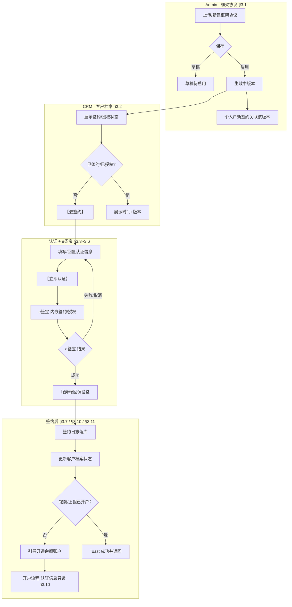
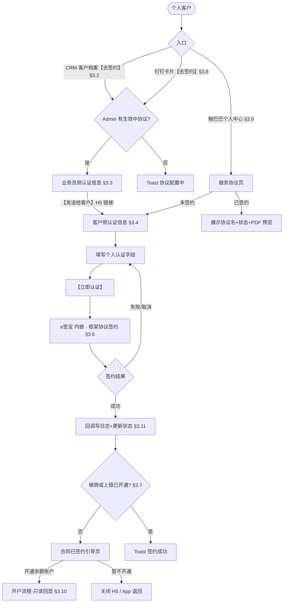
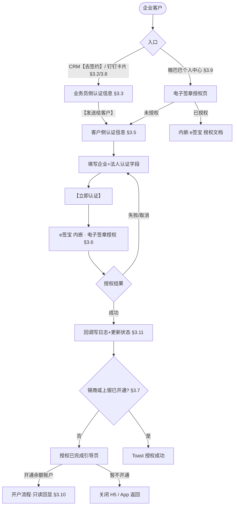
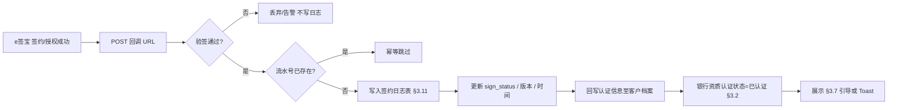
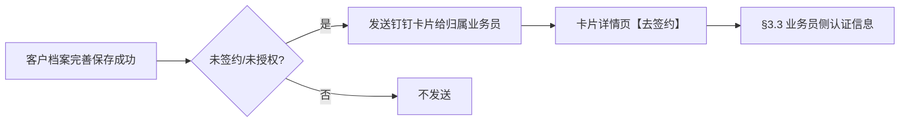
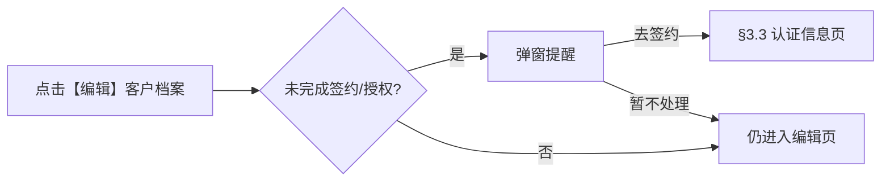
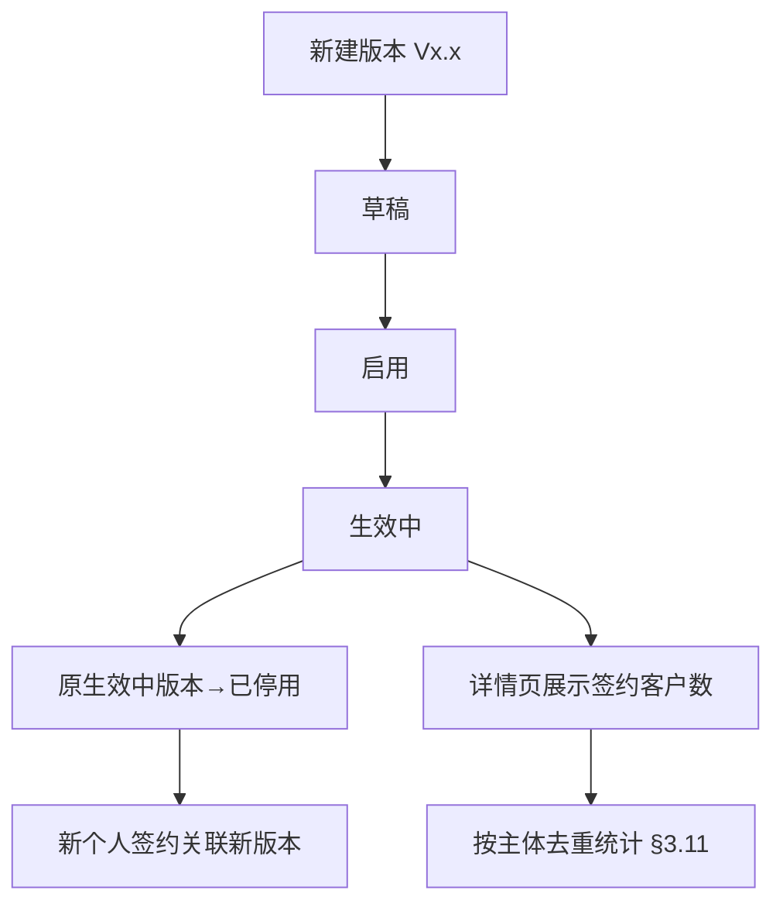
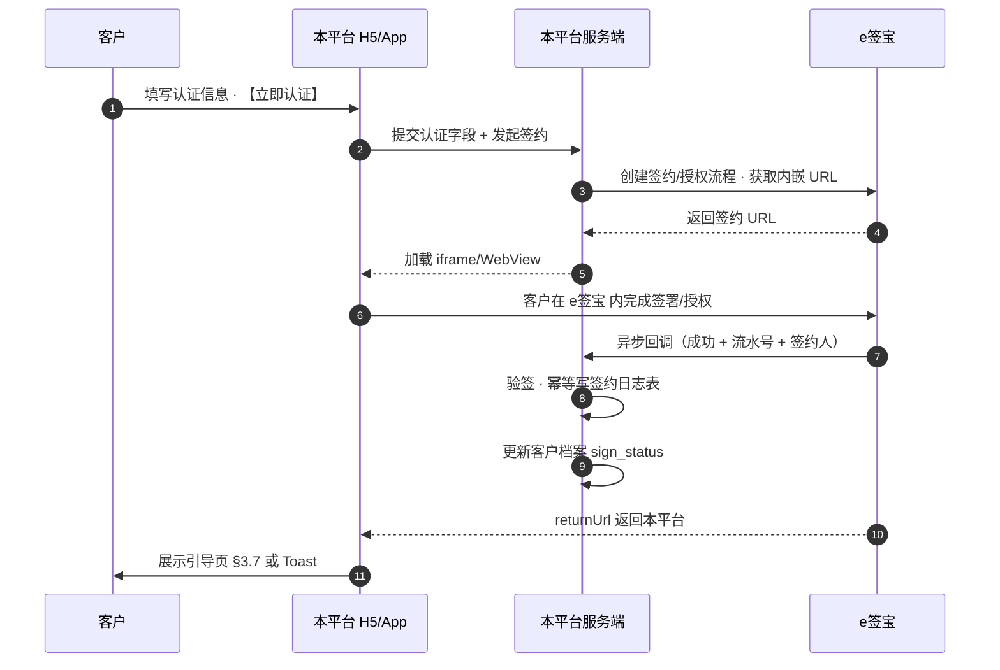

| 文档版本 | 日期 | 撰写人 | 修改描述 |
|----------|------|--------|----------|
| V2.5 | 2026年06月11日 | — | §3.5 补充企业认证页字段填写规则明细 |
| V2.4 | 2026年06月11日 | — | 完善 §4 数据统计 |
| V2.3 | 2026年06月11日 | — | 完善 §2.3 交互图 |
| V2.2 | 2026年06月11日 | — | 完善 §2.1 功能流程图 |
| V2.1 | 2026年06月11日 | — | §3.11 产品确认：仅落库、无页面 |
| V2.0 | 2026年06月11日 | — | 完善 §3.11 签约日志 |
| V1.9 | 2026年06月11日 | — | 完善 §3.10 开户流程-信息回显 |
| V1.8 | 2026年06月11日 | — | §3.9 产品确认结论落地 |
| V1.7 | 2026年06月11日 | — | 完善 §3.9 粮巴巴-个人中心入口 |
| V1.6 | 2026年06月11日 | — | §3.8 产品确认结论落地 |
| V1.5 | 2026年06月11日 | — | 完善 §3.8 客户注册-钉钉卡片 |
| V1.4 | 2026年06月11日 | — | §3.7 产品确认结论落地 |
| V1.3 | 2026年06月11日 | — | 完善 §3.7 签约后-余额账户引导 |
| V1.2 | 2026年06月11日 | — | §3.6 补充个人户 e签宝 签约流程 |
| V1.1 | 2026年06月11日 | — | §3.5 确认 + §3.6 e签宝流程对接 |
| V1.0 | 2026年06月11日 | — | 完善 §3.5 CRM-认证信息（客户侧-企业） |
| V0.9 | 2026年06月11日 | — | §3.4 产品确认结论落地 |
| V0.8 | 2026年06月11日 | — | 完善 §3.4 CRM-认证信息（客户侧-个人） |
| V0.7 | 2026年06月11日 | — | 完善 §3.3 CRM-认证信息（业务员侧） |
| V0.6 | 2026年06月11日 | — | §3.2 产品确认结论落地 |
| V0.5 | 2026年06月11日 | — | 完善 §3.2 CRM-客户档案 |
| V0.4 | 2026年06月11日 | — | 完善 §3.1 Admin-框架协议管理 |
| V0.3 | 2026年06月11日 | — | 新增需求 #11：客户侧签约日志 |
| V0.2 | 2026年06月11日 | — | 完善 §1 背景和目标 |
| V0.1 | 2026年06月11日 | — | 需求清单与文档框架 |

> **撰写进度说明**：**§2.1～§2.3、§3.1～§3.11、§4 初稿均已完成**；附录（全局约束/风险控制）待补充；各模块待产品逐章确认。

---

## 1. 背景和目标

> **状态：✅ 初稿已完成**（待产品确认）

### 1.1 背景

依据国家电子签名与合同管理相关规范，平台侧所有需客户签约的合同，须通过合规的第三方电子签约平台完成身份认证与签章授权。粮巴巴/CRM 当前客户签约以线下或分散流程为主，存在以下问题：

1. **合规风险**：个人与企业客户的电子签约、签章授权未统一接入合规平台，难以满足监管对电子合同效力与留痕的要求。
2. **流程割裂**：客户档案、开户、交易签约分属不同环节，签约状态无法在 CRM、粮巴巴 App/小程序、开户流程中一致展示与校验。
3. **个人与企业差异未产品化**：
   - **个人客户**：须先与平台签订**框架协议**（在 e签宝 完成），框架协议生效后，视为客户默认同意后续每笔交易的条件，交易环节可简化重复签约。
   - **企业客户**：须在 e签宝 完成**电子签章授权**，授权平台在后续每笔交易中调用企业电子签章完成合同盖章，无需每次重复授权。

因此，本期需对接 **e签宝**，在 Admin、CRM 客户档案、认证信息、粮巴巴个人中心、开户及注册提醒等链路中，打通「协议管理 → 认证填写 → e签宝 签约/授权 → 状态回写 → 后续业务引导」闭环。

### 1.2 目标

1. **合规签约**：个人客户完成框架协议签约，企业客户完成电子签章授权，均可追溯、可查询；**每次签约留存日志（签约时间、签约版本、签约人）**。
2. **状态可视**：在客户档案（客户信息、银行资质）、粮巴巴个人中心等位置统一展示签约/授权状态。
3. **流程顺畅**：业务员可发起认证并发送客户链接；客户在本系统填写认证信息后，内嵌跳转 e签宝 完成签约/授权。
4. **业务衔接**：签约完成后引导未开户客户开通余额账户；已签约客户开户时认证信息只读回显；注册与编辑档案环节主动提醒未完成签约的客户。
5. **协议可管**：Admin 支持框架协议上传与版本管理，个人户签约关联当前生效版本。

### 1.3 目标用户

| 角色 | 使用场景 |
|------|----------|
| 平台运营/Admin | 上传、发布、版本管理框架协议 |
| CRM 业务员 | 查看客户签约状态，发起【去签约】，发送认证链接给客户 |
| 个人客户 | 填写个人认证信息，签订框架协议，在 App/小程序查看协议状态 |
| 企业客户 | 填写企业/法人认证信息，完成电子签章授权 |
| 粮巴巴 App/小程序用户 | 个人中心查看服务协议或签章授权状态及内容 |

### 1.4 业务价值

- 满足国家电子签约合规要求，降低合同法律效力风险
- 减少重复签约操作，提升个人/企业后续交易签约效率
- 签约状态与客户档案、开户、交易链路打通，减少业务员线下跟进成本

### 1.5 名词释义

| 术语 | 定义 |
|------|------|
| e签宝 | 本期对接的第三方电子签约与电子签章平台 |
| 框架协议 | 个人客户在 e签宝 与平台签订的服务协议；生效后默认同意后续每笔交易条件 |
| 服务协议签约 | 个人户在 CRM/粮巴巴 中的签约能力统称，含状态展示与【去签约】入口 |
| 电子签章授权 | 企业客户在 e签宝 授权平台调用企业电子签章；后续交易直接调用签章 |
| 认证信息 | 跳转 e签宝 前，在本系统收集/展示/回显的实名认证字段（个人/企业字段不同） |
| 签约状态 | 个人：是否已签当前生效版本框架协议；企业：是否已完成电子签章授权 |
| 认证状态 | 客户档案-银行资质 Tab 展示的认证结果，本期与签约/授权状态联动 |
| 协议版本 | Admin 管理的框架协议版本号及生效时间，个人户签约需关联具体版本 |
| 签约日志 | 客户完成 e签宝 签约/授权后系统落库的记录，含签约时间、签约版本、签约人等；本期无前台查询页，供后续查询与统计 |

---

## 2. 需求方案

### 2.1 功能流程图

> **状态：✅ 初稿已完成**（待产品确认）

> 说明：下图覆盖本期 **Admin 协议管理、个人签约、企业授权、回调落库、开户引导** 及 **钉钉卡片 / 编辑拦截** 等辅助分支；细节规则见 §3 各模块。

#### 2.1.1 总体业务闭环



#### 2.1.2 个人户 · 框架协议签约主流程



#### 2.1.3 企业户 · 电子签章授权主流程



#### 2.1.4 e签宝 回调与状态同步



#### 2.1.5 辅助流程

**A. 客户注册 · 钉钉卡片（§3.8）**



**B. 编辑客户档案拦截（§3.2 #8）**



**C. Admin · 框架协议版本（§3.1 / §3.11）**



#### 2.1.6 流程与章节对照

| 流程图 | 对应章节 | 说明 |
|--------|----------|------|
| 2.1.1 总体闭环 | §3.1～§3.11 | 全貌 |
| 2.1.2 个人签约 | §3.2～§3.4、§3.6～§3.10 | 含 CRM / 粮巴巴 / H5 入口 |
| 2.1.3 企业授权 | §3.2～§3.3、§3.5～§3.10 | 授权替代框架协议 |
| 2.1.4 回调同步 | §3.6、§3.11 | 以服务端回调为准；日志仅落库 |
| 2.1.5 辅助流程 | §3.1、§3.2、§3.8 | 钉钉卡片、编辑拦截、版本统计 |

### 2.2 需求列表

| 分类（产品模块） | 主要功能点 | 功能点拆分 | 优先级 | 对应需求编号 |
|------------------|------------|------------|--------|--------------|
| Admin-框架协议管理 | 框架协议上传与版本管理 | 协议文件上传<br/>版本号/生效时间管理<br/>历史版本查看与启用<br/>个人户签约关联当前生效版本 | P0 | #1 |
| CRM-客户档案 | 服务协议签约展示 | 客户信息 Tab 增加「服务协议签约」及状态<br/>未签约显示【去签约】<br/>个人户按协议版本展示签约状态 | P0 | #2 |
| CRM-客户档案 | 银行资质认证状态 | 认证状态根据是否完成签约/授权展示<br/>与客户信息 Tab 状态联动 | P0 | #2 |
| CRM-认证信息 | 业务员侧认证信息页 | 【去签约】跳转认证信息页<br/>系统已有字段回显，无则留空<br/>个人/企业字段差异<br/>【发送给客户】生成客户填写链接 | P0 | #3 #4 |
| CRM-认证信息 | 客户侧认证信息填写 | 客户打开链接进入填写页<br/>个人/企业不同字段与校验<br/>【立即认证】跳转 e签宝（内嵌）<br/>**签约完成后写入签约日志** | P0 | #4 #5 #11 |
| 签约日志 | 客户侧签约日志落库 | e签宝 回调成功后写入日志表<br/>记录签约时间、签约版本、签约人<br/>**仅数据库存储，本期无查询页面**；便于后续查询与统计 | P0 | #11 |
| e签宝对接 | 签约/授权内嵌 | e签宝 H5/页面嵌入本系统页面<br/>个人：框架协议签约<br/>企业：电子签章授权<br/>签约结果回调与状态同步 | P0 | #5 |
| 签约后引导 | 余额账户开通引导 | 签约完成后判断是否已开户<br/>未开户：引导页（开通余额账户 / 暂不开通回客户档案） | P0 | #6 |
| 客户注册 | 钉钉卡片提醒 | 已有钉钉卡片详情页新增【去签约】<br/>跳转 §3.3 认证信息页 | P0 | #7 |
| CRM-客户档案 | 编辑拦截提醒 | 修改客户档案时判断签约/授权状态<br/>未完成则弹窗提醒去签约/授权 | P1 | #8 |
| 粮巴巴-个人中心 | 服务协议/签章授权入口 | App/小程序个人中心新增入口<br/>个人户：服务协议签约及状态、协议内容<br/>企业户：电子签章授权及状态、授权内容 | P0 | #9 |
| 开户流程 | 已签约客户信息回显 | 已签约客户开户时回显认证信息<br/>字段只读不可修改 | P0 | #10 |

**需求编号与原始清单对照**

| 编号 | 原始需求摘要 | PRD 模块 |
|------|--------------|----------|
| 1 | 框架协议内容上传及版本管理 | Admin-框架协议管理 |
| 2 | 客户档案增加签约状态；【去签约】；银行资质认证状态联动 | CRM-客户档案 |
| 3 | 【去签约】→ 认证信息页；有值回显无值空 | CRM-认证信息（业务员侧） |
| 4 | 客户链接打开；个人/企业不同认证信息 | CRM-认证信息（客户侧） |
| 5 | 【立即认证】→ e签宝 内嵌签约/授权 | e签宝对接 |
| 6 | 签约完成 → 未开户则引导开通余额账户 | 签约后引导 |
| 7 | 注册流程钉钉卡片提醒签约 | 客户注册 |
| 8 | 修改客户档案未签约弹窗提醒 | CRM-客户档案-编辑拦截 |
| 9 | 粮巴巴个人中心增加协议/授权入口 | 粮巴巴-个人中心 |
| 10 | 开户流程已签约客户认证信息回显不可改 | 开户流程 |
| 11 | 客户侧签约完成后记录签约日志（签约时间、签约版本、签约人） | 客户侧认证信息 / 签约日志 |

### 2.3 交互图

> **状态：✅ 初稿已完成**（待产品确认）

> **与 §2.1 的分工**：§2.1 讲业务全貌与分支判断；§2.3 讲**各角色操作路径**及**系统间调用顺序**（谁点哪里、跳转到哪一页）。

#### 2.3.1 业务员 · CRM 主导签约（个人户示例）

```
客户档案（未签约）
  → 【去签约】
  → 业务员侧认证信息页（只读回显，§3.3）
  → 【发送给客户】复制/分享 H5 链接
  → （客户侧链路见 2.3.2）
  → 客户完成签约后，CRM 客户档案自动刷新为「已签约（Vx.x）」
```

企业户：将「服务协议签约」替换为「电子签章授权」，后续链路与个人户一致（§3.5 替代 §3.4）。

**钉钉卡片入口（§3.8）**

```
客户档案完善保存
  → 钉钉卡片推送给归属业务员
  → 业务员打开卡片详情页
  → 【去签约】
  → 业务员侧认证信息页（§3.3，不经客户档案中转）
  → 【发送给客户】…
```

#### 2.3.2 客户 · H5 链接完成签约/授权

**个人户**

```
打开业务员分享的 H5 链接
  → 客户侧个人认证信息页（§3.4）
  → 填写/补全认证字段
  → 【立即认证】
  → 本平台内嵌 e签宝 H5（框架协议签约，§3.6）
  → e签宝 完成签署 → 返回本平台
  → 服务端回调落库（§3.11）→ 更新签约状态
  → 未开户：「合同已签约」引导页（§3.7）
      → 【开通余额账户】→ 开户流程（认证信息只读，§3.10）
      → 【暂不开通】→ 关闭 H5
  → 已开户：Toast「签约成功」→ 关闭/返回
```

**企业户**

```
打开 H5 链接
  → 客户侧企业认证信息页（§3.5）
  → 【立即认证】
  → 内嵌 e签宝（电子签章授权）
  → 返回本平台 → 「授权已完成」引导页（§3.7）
  → 后续开户口径同个人户
```

#### 2.3.3 客户 · 粮巴巴 App/小程序

**个人户**

```
我的 Tab → 【服务协议签约】
  → 服务协议页（协议名 + 签约状态，§3.9）
  → 未签约：【去签约】
  → 客户侧个人认证信息页（§3.4）
  → 【立即认证】→ e签宝 内嵌 → 回调 → 引导页/Toast
  → 已签约：同页展示协议 PDF 预览（无下载按钮）
```

**企业户**

```
我的 Tab → 【电子签章授权】
  → 电子签章授权页（§3.9）
  → 未授权：【去授权】→ §3.5 → e签宝 授权
  → 已授权：内嵌展示 e签宝 授权文档
```

#### 2.3.4 平台运营 · Admin

```
Admin → 框架协议管理（§3.1）
  → 【新建版本】→ 上传 PDF + 版本号 + e签宝 模板 ID
  → 【保存并启用】→ 生效中版本
  → 个人户新签约自动关联该版本
  → 生效中版本详情页：展示签约客户数（按主体去重，§3.11）
```

#### 2.3.5 系统交互时序（签约/授权）



#### 2.3.6 角色 × 场景交互对照

| 角色 | 典型场景 | 交互路径 | 对应章节 |
|------|----------|----------|----------|
| 平台运营 | 发布新协议版本 | Admin 新建→启用→生效中 | §3.1 |
| 业务员 | 跟进未签约客户 | 客户档案→【去签约】→发链接 | §3.2、§3.3 |
| 业务员 | 注册后提醒 | 钉钉卡片→【去签约】→发链接 | §3.8、§3.3 |
| 业务员 | 编辑档案提醒 | 【编辑】→弹窗→去签约/暂不处理 | §3.2 #8 |
| 个人客户 | 业务员链接签约 | H5 认证→e签宝→引导开户 | §3.4、§3.6、§3.7 |
| 个人客户 | App 自助签约 | 个人中心→服务协议页→去签约 | §3.9、§3.4 |
| 企业客户 | 链接/App 授权 | 企业认证→e签宝 授权→引导 | §3.5、§3.9 |
| 个人/企业客户 | 签约后开户 | 引导页→开户（认证只读） | §3.7、§3.10 |
| 系统 | 状态同步 | e签宝 回调→落库→刷新 CRM | §3.6、§3.11 |

#### 2.3.7 与 §2.1 对照

| §2.1 功能流程图 | §2.3 交互图 |
|-----------------|-------------|
| 2.1.1 总体闭环 | 2.3.4 Admin + 2.3.5 系统时序 |
| 2.1.2 个人签约 | 2.3.1 业务员 + 2.3.2 个人 H5 + 2.3.3 粮巴巴个人 |
| 2.1.3 企业授权 | 2.3.2 企业 H5 + 2.3.3 粮巴巴企业 |
| 2.1.5 辅助流程 | 2.3.1 钉钉卡片 + 2.3.6 编辑拦截 |

---

## 3. 需求明细

> **撰写原则**：左图右逻辑；每模块单独成表一行或多行；**逐模块确认后完善**。

| 模块 | 状态 | 说明 |
|------|------|------|
| 3.1 Admin-框架协议管理 | ✅ 初稿待确认 | 需求 #1 |
| 3.2 CRM-客户档案（签约状态） | ✅ 已确认 | 需求 #2、#8 |
| 3.3 CRM-认证信息（业务员侧） | ✅ 已确认 | 需求 #3；参考图：认证信息-发送给客户 |
| 3.4 CRM-认证信息（客户侧-个人） | ✅ 已确认 | 需求 #4、#5、#11；参考图：个人认证表单 |
| 3.5 CRM-认证信息（客户侧-企业） | ✅ 已确认 | 需求 #4、#5、#11；参考图：企业认证表单 |
| 3.6 e签宝对接与回调 | ✅ 初稿待确认 | 需求 #5、#11；个人 7 步 + 企业 11 步流程图 |
| 3.7 签约后-余额账户引导 | ✅ 已确认 | 需求 #6；参考图：合同已签约引导页 |
| 3.8 客户注册-钉钉卡片 | ✅ 已确认 | 需求 #7；已有卡片页 + 【去签约】跳 §3.3 |
| 3.9 粮巴巴-个人中心入口 | ✅ 已确认 | 需求 #9；参考图：个人中心 |
| 3.10 开户流程-信息回显 | ✅ 初稿待确认 | 需求 #10；参考图：银行资质-已认证 |
| 3.11 签约日志 | ✅ 已确认 | 需求 #11；仅落库无页面 |


### 3.1 Admin-框架协议管理（需求 #1）

> **状态：✅ 初稿已完成**（待产品确认）

| 页面 | 逻辑 |
|------|------|
| **Admin-框架协议列表**<br/><br/>（原型待补充）<br/>- 列表页：版本号、协议名称、生效状态、生效时间、创建人、创建时间<br/>- 操作：【新建版本】【查看】【启用/停用】 | **1. 入口**<br/>- Admin 后台 → 合同/协议管理 → **框架协议管理**<br/>- 权限：平台运营/管理员（具体角色待权限系统确认）<br/><br/>**2. 列表字段与规则**<br/>- **版本号**：唯一，格式建议 `V{主版本}.{次版本}`，如 V1.0、V2.0；不可与历史版本重复<br/>- **协议名称**：必填，如「粮巴巴平台服务框架协议」<br/>- **生效状态**：草稿 / 待生效 / **生效中** / 已停用<br/>- **生效时间**：协议开始生效的日期时间；到达生效时间且状态为待生效时自动变为生效中<br/>- **协议文件**：PDF 格式，展示文件名与上传时间<br/>- **e签宝 模板 ID**（如有）：与 e签宝 侧框架协议模板绑定的 ID，用于个人户跳转签约<br/>- 默认按创建时间倒序；**同一时刻仅允许 1 个「生效中」版本**<br/><br/>**3. 操作与跳转**<br/>- 【新建版本】→ 新建页<br/>- 【查看】→ 详情页（只读）<br/>- 【编辑】：仅**草稿**状态可编辑<br/>- 【启用】：草稿 → 待生效 或 直接生效中（若生效时间 ≤ 当前时间）<br/>- 【停用】：生效中 → 已停用；停用后不可被新签约引用，已签约客户仍保留原版本记录<br/><br/>**4. 版本生效规则**<br/>- 新版本设为「生效中」时，原「生效中」版本自动变为「已停用」<br/>- **个人客户新发起签约**时，关联当前「生效中」版本的版本号与 e签宝 模板<br/>- **已签约客户**：保留其签约日志中的历史版本号；若新版本发布，是否需重新签约由业务策略决定（见 §6 边界）<br/><br/>**6. 边界与异常**<br/>- 无生效中版本时，个人户【去签约】入口置灰或提示「协议配置中，请稍后再试」<br/>- 协议文件大小限制：≤ 20MB（可配置）<br/>- 仅支持 PDF 上传<br/>- 删除：仅草稿可物理删除；已发布版本不可删除，只能停用 |
| **Admin-新建/编辑框架协议**<br/><br/>（原型待补充）<br/>- 表单：版本号、协议名称、生效时间、协议文件上传、e签宝 模板 ID、备注 | **2. 页面字段与规则**<br/>- **版本号**：必填，新建时校验唯一性<br/>- **协议名称**：必填，最长 100 字<br/>- **生效时间**：必填，日期时间选择器；不可早于当前时间（编辑草稿时若已过期需重新选择）<br/>- **协议文件**：必填，PDF；支持预览、重新上传<br/>- **e签宝 模板 ID**：选填；若 e签宝 要求模板 ID 才能发起个人框架协议签约，则启用签约前必填<br/>- **备注**：选填，内部说明，不对客户展示<br/><br/>**3. 操作与跳转**<br/>- 【保存草稿】：状态 = 草稿，返回列表<br/>- 【保存并启用】：校验通过后按生效规则更新状态，返回列表<br/>- 【取消】：未保存则丢弃，返回列表<br/><br/>**7. 数据字段**<br/>- agreement_version_id、version_no、agreement_name、file_url、file_name、e_sign_template_id、status、effective_time、creator_id、created_at、updated_at、remark |
| **Admin-框架协议详情**<br/><br/>（原型待补充）<br/>- 只读展示全部字段<br/>- 可下载协议 PDF<br/>- **生效中版本**展示：签约客户数 | **3. 操作**<br/>- 【下载协议】：下载当前版本 PDF<br/>- 【返回列表】<br/><br/>**关联数据（只读展示）**<br/>- **签约客户数**（**仅生效中/最新版本**展示）：<br/>  - 统计口径：签约日志中 `签约版本 = 当前版本号` 的成功记录<br/>  - **按主体 id 去重**，同一主体只计 1 次<br/>  - 已停用/历史版本详情页**不展示**该指标<br/>- 最近签约时间：取该版本下最近一条成功日志的签约时间 |

**与其他模块联动**

| 联动模块 | 规则 |
|----------|------|
| CRM-客户档案 §3.2 | 个人户「服务协议签约」状态展示所签版本号；未签约客户关联生效中版本 |
| 客户侧认证/e签宝 §3.4~3.6 | 【立即认证】携带生效中版本的 e签宝 模板 ID 与版本号 |
| 签约日志 §3.11 | 个人户签约成功后，`签约版本` = 本次使用的框架协议版本号 |
| 粮巴巴个人中心 §3.9 | 个人户可查看所签协议版本及协议文件（生效中或已签版本） |

**版本变更策略（待业务确认，默认方案）**

| 场景 | 默认规则 |
|------|----------|
| 新版本发布 | 仅影响**新发起签约**的个人客户 |
| 已签旧版本客户 | 维持旧版本有效，不强制重签；客户档案展示已签版本号 |
| 强制重签（若业务要求） | 需另开需求：标记「待更新协议」并限制交易 |


### 3.2 CRM-客户档案（需求 #2、#8）

> **状态：✅ 已确认**（2026-06-11）

**产品确认结论**
| 事项 | 结论 |
|------|------|
| 字段命名 | 个人户：**服务协议签约**；企业户：**电子签章授权** |
| 编辑拦截 | **提醒但不阻断**，【暂不处理】可继续编辑 |
| 老客户 | 已开户但未走 e签宝 的**不强制补签**；业务员通过【去签约】/分享链接引导客户签约即可 |
| 已签约展示 | 展示**签约时间**；**不展示签约人**（签约人仅记录在签约日志 §3.11） |

| 页面 | 逻辑 |
|------|------|
| **客户档案-客户信息 Tab（未签约）**<br/><br/><br/>- Tab：客户信息 / 养殖信息 / 机会点 / 交易配置<br/>- 新增行：**服务协议签约**（个人）或 **电子签章授权**（企业）<br/>- 状态：未签约 / 未授权<br/>- 右侧蓝色文字按钮：**【去签约】** | **1. 入口**<br/>- CRM → 客户详情 → **客户档案** → 默认「客户信息」Tab<br/>- 业务员、管理者均可查看（编辑权限按现有角色）<br/><br/>**2. 新增字段与展示规则**<br/>- 字段位置：在「锡商余额开通状态」与「经营品类」之间插入（顺序可按 UI 稿微调）<br/>- **个人户（主体类型 = 个人）**<br/>  - 字段名：**服务协议签约**<br/>  - 状态枚举：未签约 / 已签约<br/>  - 已签约时展示：`已签约（V1.0）` + **签约时间**；括号内为签约日志中的**签约版本**<br/>  - 未签约时：状态文案「未签约」+ 右侧 **【去签约】**<br/>- **企业户（主体类型 = 企业）**<br/>  - 字段名：**电子签章授权**<br/>  - 状态枚举：未授权 / 已授权<br/>  - 已授权时展示：`已授权` + **签约时间**（取签约日志最近一条，格式如 2026/6/11 14:30）<br/>  - 未授权时：状态文案「未授权」+ 右侧 **【去签约】**<br/>- **已签约/已授权时**：展示签约时间，**不展示签约人**（签约人仅存 §3.11 日志）<br/><br/>**3. 操作与跳转**<br/>- 【去签约】→ 跳转 **§3.3 业务员侧认证信息页**，携带当前主体 id、主体类型<br/>- 若 Admin 无生效中框架协议（仅个人户校验）：【去签约】置灰，Toast「协议配置中，请稍后再试」<br/>- 【编辑】→ 见下方「编辑拦截弹窗」逻辑<br/><br/>**6. 边界与异常**<br/>- 签约进行中（e签宝 未回调）：展示「签约中」，隐藏【去签约】<br/>- 签约失败：回到「未签约/未授权」，可再次【去签约】 |
| **客户档案-客户信息 Tab（已签约/已授权）**<br/><br/>（原型待补充）<br/>- 个人：服务协议签约 = 已签约（Vx.x），无【去签约】<br/>- 企业：电子签章授权 = 已授权，无【去签约】<br/>- 展示**签约时间**（个人/企业均已签约/已授权时）；**不展示签约人** | **2. 已签约展示规则**<br/>- 个人户：已签约（Vx.x） + 签约时间<br/>- 企业户：已授权 + 签约时间<br/>- **不在客户档案展示签约人**，签约人仅存签约日志<br/>- 个人户已签历史版本仍展示已签版本号（与 §3.1 版本策略一致）<br/>- 点击状态文案（可选）：跳转协议 PDF 预览<br/><br/>**7. 数据字段**<br/>- sign_status、signed_version_no、signed_at（页面展示）；signer_name 仅存日志表 |
| **客户档案-银行资质 Tab**<br/><br/><br/>- 资质类型、角色类型<br/>- **认证状态**（红框字段）：已认证 / 未认证<br/>- 平安银行签约状态等原有字段保留 | **1. 入口**<br/>- 客户档案 → **银行资质** Tab<br/><br/>**2. 认证状态联动规则（本期核心）**<br/>- **认证状态**取值与「客户信息 Tab 签约/授权状态」联动：<br/>  - 个人户 **已签约** → 认证状态 = **已认证**<br/>  - 个人户 **未签约 / 签约中** → 认证状态 = **未认证**<br/>  - 企业户 **已授权** → 认证状态 = **已认证**<br/>  - 企业户 **未授权 / 签约中** → 认证状态 = **未认证**<br/>- 本期**不以**银行开户、绑卡结果作为认证状态依据；仅依据 e签宝 签约/授权结果<br/>- 与「平安银行签约状态」「锡商余额开通状态」等**独立展示**，互不覆盖<br/><br/>**6. 边界**<br/>- e签宝 回调延迟：签约中期间认证状态仍为未认证<br/>- **老客户（已开户但未走 e签宝）**：不强制补签、不批量提醒；认证状态仍为未认证，业务员可通过【去签约】进入 §3.3 并**分享链接**给客户完成签约 |
| **编辑客户档案-拦截弹窗**<br/><br/>（原型待补充）<br/>- 弹窗标题：提醒签约/授权<br/>- 文案 + 【去签约】【暂不处理】 | **1. 触发时机（需求 #8）**<br/>- 用户在客户档案任意 Tab 点击底部 **【编辑】**<br/>- 且当前主体 **未完成** 签约/授权（个人未签约 / 企业未授权）<br/><br/>**2. 弹窗规则**<br/>- **个人户**文案示例：该客户尚未完成服务协议签约，请先完成签约后再编辑档案。<br/>- **企业户**文案示例：该客户尚未完成电子签章授权，请先完成授权后再编辑档案。<br/>- 【去签约】→ 跳转 §3.3 认证信息页<br/>- 【暂不处理】→ 关闭弹窗，**仍允许进入编辑页**（**已确认：提醒但不阻断**）<br/><br/>**3. 不弹窗条件**<br/>- 已签约/已授权<br/>- 签约中：提示「签约处理中，请稍后再编辑」（可选） |

**状态联动总表**

| 主体类型 | 客户信息 Tab | 银行资质-认证状态 | 【去签约】 |
|----------|--------------|-------------------|------------|
| 个人 | 未签约 | 未认证 | 显示 |
| 个人 | 已签约（Vx.x） | 已认证 | 隐藏 |
| 企业 | 未授权 | 未认证 | 显示 |
| 企业 | 已授权 | 已认证 | 隐藏 |
| 任意 | 签约中 | 未认证 | 隐藏 |

**与其他模块联动**

| 模块 | 规则 |
|------|------|
| §3.1 框架协议 | 个人户【去签约】关联 Admin 生效中版本 |
| §3.3 认证信息 | 【去签约】跳转目标页 |
| §3.11 签约日志 | 回调成功后更新 sign_status、signed_version_no、signed_at；签约人仅存日志，不在档案展示 |
| §3.10 开户流程 | 已认证（已签约）客户开户信息只读，见 §3.10 |


### 3.3 CRM-认证信息（业务员侧）（需求 #3）

> **状态：✅ 已确认**

| 页面 | 逻辑 |
|------|------|
| **认证信息页（业务员侧-个人户）**<br/><br/><br/>- 顶部：主体名称、手机号、主体类型<br/>- 状态行：**服务协议签约** + 状态（未签约/已签约/签约中）<br/>- 只读字段：身份证正反面、姓名、身份证号、证件到期日、实名手机号等<br/>- 有值回显，无值显示 `--`<br/>- 底部：**【发送给客户】** | **1. 入口**<br/>- CRM → 客户详情 → 客户档案 → 【去签约】→ 本页<br/>- 携带参数：主体 id、主体类型（个人）<br/>- 权限：当前客户归属业务员及有查看权限的管理者<br/><br/>**2. 页面定位**<br/>- **业务员只读查看**客户已有认证字段，**不可在本页编辑**<br/>- 主要操作：生成客户侧填写链接并发送，由客户在 §3.4 填写后完成 e签宝 签约<br/><br/>**3. 顶部基础信息（只读）**<br/>- **主体名称**：客户档案主体名称<br/>- **手机号**：客户档案绑定手机号<br/>- **主体类型**：个人<br/><br/>**4. 签约状态行**<br/>- 字段名：**服务协议签约**<br/>- 状态与 §3.2 一致：未签约 / 已签约（Vx.x）+ 签约时间 / 签约中<br/>- **不展示签约人**<br/>- 已签约 / 签约中：隐藏底部【发送给客户】<br/><br/>**5. 认证字段展示（只读，有值回显、无值 `--`）**<br/>- 身份证正反面（缩略图，可点击查看大图）<br/>- 姓名<br/>- 身份证号（脱敏展示，如 110***********1234）<br/>- 证件到期日（OCR/系统回显，只读）<br/>- 实名手机号<br/>- 字段来源：客户档案 / 历史认证信息 / 开户信息（按系统已有数据优先级回显）<br/><br/>**6. 操作**<br/>- 【发送给客户】→ 见下方「发送给客户」弹窗/面板<br/><br/>**7. 边界**<br/>- Admin 无生效中框架协议：进入页面前拦截，Toast「协议配置中，请稍后再试」，不进入本页<br/>- 老客户（已开户未走 e签宝）：允许进入并【发送给客户】，不强制补签 |
| **认证信息页（业务员侧-企业户）**<br/><br/><br/>- 顶部：主体名称、手机号、主体类型<br/>- 状态行：**电子签章授权** + 状态（未授权/已授权/签约中）<br/>- 只读字段：营业执照、企业名称、统一社会信用代码、法人信息等<br/>- 底部：**【发送给客户】** | **1. 入口**<br/>- 同个人户，主体类型 = 企业<br/><br/>**2. 签约状态行**<br/>- 字段名：**电子签章授权**（企业户不用「服务协议签约」）<br/>- 状态：未授权 / 已授权 + 签约时间 / 签约中<br/><br/>**3. 认证字段展示（只读，有值回显、无值 `--`）**<br/>- 营业执照照片<br/>- 企业名称<br/>- 统一社会信用代码<br/>- 法人身份证正反面<br/>- 法人姓名<br/>- 法人身份证号（脱敏）<br/>- 法人证件到期日（OCR/系统回显，只读）<br/>- 法人手机号<br/><br/>**4. 操作与边界**<br/>- 同个人户；【发送给客户】逻辑一致<br/>- 企业户不校验 Admin 框架协议生效（授权协议由 e签宝 侧处理） |
| **【发送给客户】**<br/><br/>（原型待补充）<br/>- 弹窗/底部抽屉：客户填写链接<br/>- 【复制链接】【分享到企微】<br/>- 链接有效期提示 | **1. 触发**<br/>- 点击底部 **【发送给客户】**<br/>- 前置条件：当前主体 **未签约/未授权**，且非「签约中」<br/><br/>**2. 链接生成规则**<br/>- 系统生成**唯一客户侧链接**，关联：主体 id、主体类型、发起业务员 id、当前生效协议版本（个人户）<br/>- 链接形态：H5 短链或带 token 的 URL（具体域名待运维配置）<br/>- **有效期**：默认 7 天（可配置）；过期后客户打开提示「链接已失效，请联系业务员重新发送」<br/>- 同一主体可重复生成链接；以**最后一次有效链接**为准，旧链接可置失效（待技术方案确认）<br/><br/>**3. 分享方式**<br/>- 【复制链接】：复制到剪贴板，Toast「已复制」<br/>- 【分享到企微】：调起企微分享（若 CRM 在企微侧边栏内），预填文案示例：<br/>  - 个人户：「您好，请完善认证信息并完成服务协议签约：[链接]」<br/>  - 企业户：「您好，请完善认证信息并完成电子签章授权：[链接]」<br/>- 业务员亦可手动通过微信/短信等方式发送复制链接<br/><br/>**4. 客户打开链接**<br/>- 个人户 → **§3.4 客户侧认证信息（个人）**<br/>- 企业户 → **§3.5 客户侧认证信息（企业）**<br/>- 链接内携带的主体信息与 CRM 一致；客户侧可编辑空白字段<br/><br/>**5. 消息与记录（可选）**<br/>- 记录发送时间、发送人（业务员）、链接 token，便于追溯<br/>- 客户完成填写/签约后，业务员侧本页字段随回写刷新<br/><br/>**6. 边界**<br/>- 已签约/已授权：不展示【发送给客户】<br/>- 签约中：提示「客户签约处理中，请稍候」，不可重复发送<br/>- 链接打开次数不限；签约成功后链接访问跳转「已完成签约」提示页 |

**字段回显优先级（个人/企业通用）**

| 优先级 | 数据来源 | 说明 |
|--------|----------|------|
| 1 | 最近一次 e签宝 认证/签约成功回写 | 以最新成功记录为准 |
| 2 | 客户档案已维护字段 | CRM 客户信息 Tab 等 |
| 3 | 开户/银行资质已有信息 | 老客户可能已有部分字段 |
| 4 | 无数据 | 展示 `--` |

**与其他模块联动**

| 模块 | 规则 |
|------|------|
| §3.2 客户档案 | 【去签约】跳转本页；签约状态与本页状态行一致 |
| §3.1 框架协议 | 个人户发链接时关联 Admin 当前生效中版本号 |
| §3.4 / §3.5 客户侧 | 【发送给客户】链接打开目标页；客户【立即认证】走 e签宝 |
| §3.6 e签宝 | 客户侧完成认证后回调，刷新本页只读字段与签约状态 |
| §3.11 签约日志 | 签约成功后写日志；本页不展示签约人 |


### 3.4 CRM-认证信息（客户侧-个人）（需求 #4、#5、#11）

> **状态：✅ 已确认**（2026-06-11）

**产品确认结论**
| 事项 | 结论 |
|------|------|
| 字段一致性 | 姓名、身份证号、手机号、身份证正反面与**现有开户流程**字段定义及校验规则保持一致 |
| 证件到期日 | **客户无需填写**；根据身份证照片 OCR 识别结果**只读展示** |
| 签约成功引导 | 【暂不开通，客户档案】→ **关闭 H5 页面** |

| 页面 | 逻辑 |
|------|------|
| **客户侧-个人认证信息填写**<br/><br/><br/>- 顶部只读：客户名称、客户手机号<br/>- 区块：**个人信息认证**<br/>- 上传：身份证人像面 / 国徽面<br/>- 输入：姓名、身份证号、实名手机号<br/>- 只读展示：证件到期日（OCR 识别）<br/>- 底部：**【立即认证】** | **1. 入口**<br/>- **主入口**：打开 §3.3 业务员发送的客户链接（H5）<br/>- **次入口**：粮巴巴 App/小程序个人中心 → 服务协议签约 → **服务协议页** → 未签约时【去签约】进入本页（见 §3.9）<br/>- 前置：主体类型 = 个人；Admin 存在生效中框架协议<br/><br/>**2. 页面定位**<br/>- 客户在**本系统 H5** 填写/补全实名认证信息<br/>- 填写完成后【立即认证】跳转 **§3.6 e签宝 内嵌页** 完成框架协议签约<br/>- 签约成功写入 **§3.11 签约日志**，并更新 §3.2 签约状态<br/><br/>**3. 顶部信息（只读）**<br/>- **客户名称**：主体名称<br/>- **客户手机号**：客户档案绑定手机号<br/><br/>**4. 表单字段与规则**<br/>| 字段 | 必填 | 规则 |<br/>|------|------|------|<br/>| 身份证人像面 | 是 | 与**现有开户**身份证上传一致；OCR 识别姓名、身份证号 |<br/>| 身份证国徽面 | 是 | 与**现有开户**一致；OCR 识别**证件到期日**（只读展示） |<br/>| 姓名 | 是 | 与**现有开户**姓名字段一致；与身份证 OCR/填写一致 |<br/>| 身份证号 | 是 | 与**现有开户**身份证号字段及校验规则一致 |<br/>| 证件到期日 | — | **只读展示**，客户无需填写；上传身份证后由 OCR 自动识别（国徽面识别有效期）；未识别时展示 --，**不阻断**【立即认证】 |<br/>| 手机号 | 是 | 与**现有开户**手机号字段一致；11 位；须为身份证实名认证手机号 |<br/><br/>**5. 回显规则**<br/>- 与 §3.3 字段回显优先级一致：e签宝 回写 > 客户档案 > 开户信息 > 空<br/>- 姓名、身份证号、手机号、身份证照片：**预填但可修改**（未签约客户允许更正）<br/>- **证件到期日**：仅 OCR/系统回显，**不可手动编辑**<br/>- 已签约客户从链接进入：跳转「已完成签约」页，不可再次编辑<br/><br/>**6. 操作与跳转**<br/>- 【立即认证】：<br/>  1. 前端校验全部必填项<br/>  2. 保存认证信息至服务端（草稿/待签约状态）<br/>  3. 携带：主体 id、生效中协议版本号、e签宝 模板 ID、认证字段快照<br/>  4. 跳转 **§3.6 e签宝 内嵌签约页**（个人框架协议）<br/>  5. 跳转前将主体 related 状态置为 **签约中**（§3.2 联动）<br/><br/>**7. 边界与异常**<br/>- 链接 token 无效/过期：全页提示「链接已失效，请联系业务员重新发送」<br/>- 主体已签约：提示「您已完成服务协议签约」+ 展示签约时间（不展示签约人）<br/>- 签约中：提示「签约处理中，请稍候」，不可重复【立即认证】<br/>- 姓名/身份证号/手机号 OCR 失败：不阻断，客户可手动填写<br/>- 证件到期日 OCR 失败：展示 --，不阻断【立即认证】<br/>- 网络异常：Toast「提交失败，请重试」 |
| **e签宝 内嵌签约（个人）**<br/><br/><br/>- 本系统页内嵌 e签宝 H5<br/>- 展示待签框架协议<br/>- 客户完成签署 | **1. 触发**<br/>- 【立即认证】校验通过后进入<br/><br/>**2. 页面规则**<br/>- 在本系统 **iframe / WebView 内嵌** e签宝 H5；**流程步骤见 §3.6**<br/>- 签约文档 = Admin 生效中框架协议（Vx.x）<br/>- 签约人 = e签宝 回调返回（通常为表单姓名，不在档案展示）<br/><br/>**3. 结果处理**<br/>- **成功**：见下方「签约成功」；写签约日志；`签约版本` = 本次生效中版本号<br/>- **失败/取消**：回到认证信息页，状态恢复未签约，可再次【立即认证】<br/>- 详细对接见 **§3.6** |
| **签约成功-后续引导**<br/><br/><br/>- 文案：合同已签约<br/>- 未开户：引导开通余额账户<br/>- 【开通余额账户】【暂不开通，客户档案】 | **1. 触发**<br/>- e签宝 签约成功且回调处理完成后展示<br/><br/>**2. 分支逻辑（需求 #6，详见 §3.7）**<br/>- 判断客户是否已开通余额账户（**仅锡商/上银**，§3.7）<br/>- **未开户**：展示引导页<br/>  - 【开通余额账户】→ 跳转现有开户流程<br/>  - 【暂不开通，客户档案】→ **H5：关闭页面**；**App：返回上一页**（§3.7 已确认）<br/>- **已开户**：Toast「签约成功」后关闭页面或返回来源页<br/><br/>**3. 状态回写**<br/>- §3.2：`服务协议签约` = 已签约（Vx.x）+ 签约时间<br/>- §3.2 银行资质：认证状态 = 已认证<br/>- §3.11：写入签约日志（签约时间、签约版本、签约人） |

**签约日志写入（本模块触发，明细见 §3.11）**

| 字段 | 个人户取值 |
|------|------------|
| 签约时间 | e签宝 回调成功时间 |
| 签约版本 | Admin 生效中框架协议版本号 |
| 签约人 | 表单姓名（客户本人） |
| 签约类型 | 框架协议签约 |
| 操作来源 | 客户侧链接 / 粮巴巴 App |

**与其他模块联动**

| 模块 | 规则 |
|------|------|
| §3.3 业务员侧 | 链接来源；发送时绑定协议版本 |
| §3.1 框架协议 | 个人户签约关联生效中版本与 e签宝 模板 ID |
| §3.6 e签宝 | 内嵌签约、回调、状态同步 |
| §3.7 签约后引导 | 未开户引导开通余额账户 |
| §3.9 粮巴巴个人中心 | 次入口进入本页 |
| §3.10 开户流程 | 签约成功后开户信息可只读回显 |
| §3.11 签约日志 | 回调成功后必写 |


### 3.5 CRM-认证信息（客户侧-企业）（需求 #4、#5、#11）

> **状态：✅ 已确认**（2026-06-11）

**产品确认结论**
| 事项 | 结论 |
|------|------|
| 字段一致性 | 企业户 9 个字段与**现有开户**完全一致 |
| 授权成功文案 | 本平台引导页文案：**授权已完成** |
| 签约/授权流程 | **e签宝 侧流程**，步骤与页面由 e签宝 控制；本平台不定制，见 §3.6 |
| 法人证件到期日 | **客户无需填写**；上传法人身份证国徽面后 OCR **只读展示**（页面上可不单独占输入框，与 §3.4 个人户一致） |

**字段填写规则明细**（客户侧-企业认证信息页）

> 页面结构：**顶部只读信息** → **企业信息认证** → **企业法人认证** → 底部 **【立即认证】**。字段定义、校验与**现有开户流程企业认证**保持一致；差异仅在于本页完成后跳转 e签宝 授权（非直接开户）。

**一、顶部信息（只读，不可编辑）**

| 序号 | 字段名 | 必填 | 控件 | 填写/展示规则 | 校验与提示 |
|------|--------|------|------|---------------|------------|
| — | 客户名称 | — | 文本只读 | 取 CRM **主体名称**；可与下方「企业名称」不同 | 无校验；仅展示 |
| — | 客户手机号 | — | 文本只读 | 取客户档案**绑定手机号** | 无校验；仅展示 |

**二、企业信息认证**

| 序号 | 字段名（UI 文案） | 必填 | 控件 | 填写规则 | 格式/校验 | OCR 与联动 | 异常提示（示例） |
|------|-------------------|------|------|----------|-----------|------------|------------------|
| 1 | 请上传营业执照照片 | 是 | 图片上传 | 上传 **营业执照正本（原件）** 照片；支持拍照/相册；可重新上传覆盖 | 格式：jpg / jpeg / png；大小：与**现有开户**一致（建议 ≤ 5MB）；须能识别清晰边框与文字 | 上传成功后 OCR 识别 **企业名称、统一社会信用代码**，**自动回填**至字段 2、3；客户可手动修改 | 未上传：「请上传营业执照照片」<br/>格式/大小不符：「图片格式或大小不符合要求」<br/>OCR 失败：不阻断，字段可手填 |
| 2 | 企业名称 | 是 | 单行输入 |  placeholder：「请输入企业名称」 | 与开户一致：非空；长度 2～100 字（以开户为准）；不允许纯空格；建议与营业执照 OCR 结果一致 | OCR 回填后可编辑 | 为空：「请输入企业名称」 |
| 3 | 统一社会信用代码 | 是 | 单行输入 | placeholder：「请输入统一社会信用代码」 | **18 位**；字符集：数字 + 大写英文字母（不含 I、O、Z、S、V）；符合统一社会信用代码编码规则 | OCR 回填后可编辑；建议与营业执照一致 | 为空/格式错误：「请输入正确的统一社会信用代码」 |

**三、企业法人认证**

| 序号 | 字段名（UI 文案） | 必填 | 控件 | 填写规则 | 格式/校验 | OCR 与联动 | 异常提示（示例） |
|------|-------------------|------|------|----------|-----------|------------|------------------|
| 4 | 请上传法人身份证正反面照片 · 人像面 | 是 | 图片上传 | 上传法人身份证 **人像面** | 格式/大小同字段 1 | OCR 识别 **法人姓名、法人身份证号** → 回填字段 6、7 | 未上传：「请上传法人身份证人像面」 |
| 5 | 请上传法人身份证正反面照片 · 国徽面 | 是 | 图片上传 | 上传法人身份证 **国徽面** | 格式/大小同字段 1 | OCR 识别 **法人证件到期日** → **只读展示**（客户不可编辑）；未识别展示 `--` | 未上传：「请上传法人身份证国徽面」 |
| 6 | 法人姓名 | 是 | 单行输入 | placeholder：「请输入法人姓名」 | 与开户一致：非空；2～30 字；与身份证 OCR 姓名一致为佳 | OCR 回填后可编辑 | 为空：「请输入法人姓名」 |
| 7 | 法人身份证号 | 是 | 单行输入 | placeholder：「请输入法人身份证号」 | **18 位**身份证号规则（含末位 X/x）；与法人身份证人像面信息一致 | OCR 回填后可编辑 | 为空/格式错误：「请输入正确的法人身份证号」 |
| 8 | 法人证件到期日 | — | **只读展示** | **客户无需填写**；国徽面 OCR 后展示，如 `2030-12-31` 或 `长期` | 无输入校验 | 仅 OCR/系统回显；**不可手动编辑** | OCR 失败：展示 `--`，**不阻断**【立即认证】 |
| 9 | 法人实名手机号 | 是 | 单行输入 | placeholder：「法人实名手机号」<br/>辅助说明：「请输入该身份证对应的实名认证的手机号」 | **11 位**手机号；首位 1；须为**该法人身份证号在运营商侧已实名认证**的手机号（与开户规则一致） | 不与 OCR 自动回填（除非历史数据回显） | 为空/格式错误：「请输入正确的手机号」<br/>实名校验失败（若开户有）：「手机号与身份证实名信息不一致」 |

**四、【立即认证】提交校验**

| 顺序 | 校验项 | 规则 |
|------|--------|------|
| 1 | 必填完整性 | 字段 1～7、9 均已填写/上传 |
| 2 | 格式校验 | 统一社会信用代码、法人身份证号、法人手机号格式通过 |
| 3 | 图片完整性 | 营业执照 1 张 + 法人身份证正反面各 1 张 |
| 4 | 法人证件到期日 | 仅展示项；OCR 未识别 **不阻断**提交 |
| 5 | OCR 与手填一致性 | **不强制** OCR 与手填 100% 一致（OCR 失败允许手填）；若开户侧有强校验则沿用开户 |
| 6 | 通过后动作 | 保存认证信息 → 状态置 **授权中** → 跳转 §3.6 e签宝 内嵌授权页 |

**五、回显规则（与 §3.3 一致）**

| 优先级 | 数据来源 | 说明 |
|--------|----------|------|
| 1 | e签宝 / 最近一次授权成功回写 | 最新成功记录 |
| 2 | 客户档案已维护字段 | CRM |
| 3 | 历史开户信息 | 老客户 |
| 4 | 空 | 展示 placeholder |

- 可编辑字段（1～7、9）：**有值预填，允许修改**（未授权客户）
- 法人证件到期日：只读，不可改
- 已授权客户再次打开链接：跳转「已完成授权」页，**不可编辑**

| 页面 | 逻辑 |
|------|------|
| **客户侧-企业认证信息填写**<br/><br/><br/>- 顶部只读：客户名称、客户手机号<br/>- 区块1：**企业信息认证**（营业执照、企业名称、统一社会信用代码）<br/>- 区块2：**企业法人认证**（法人身份证正反面、法人姓名、法人身份证号、法人手机号）<br/>- 只读展示：法人证件到期日（OCR 识别）<br/>- 底部：**【立即认证】** | **1. 入口**<br/>- **主入口**：打开 §3.3 业务员发送的客户链接（H5）<br/>- **次入口**：粮巴巴 App/小程序个人中心 → **电子签章授权** → **电子签章授权页** → 未授权时【去授权】进入本页（见 §3.9）<br/>- 前置：主体类型 = 企业<br/>- **不校验** Admin 框架协议（企业为 e签宝 电子签章授权）<br/><br/>**2. 页面定位**<br/>- 客户在本系统 H5 填写/补全企业及法人认证信息<br/>- 【立即认证】跳转 **§3.6 e签宝 内嵌页** 完成**电子签章授权**<br/>- 授权成功写入 **§3.11 签约日志**，并更新 §3.2 授权状态<br/><br/>**3. 顶部信息（只读）**<br/>- **客户名称**：主体名称（可与企业名称不同，以 CRM 为准）<br/>- **客户手机号**：客户档案绑定手机号<br/><br/>**4. 表单字段与规则**<br/>**企业信息认证**<br/>| 字段 | 必填 | 规则 |<br/>|------|------|------|<br/>| 营业执照照片 | 是 | 与**现有开户**营业执照上传一致；正本原件；OCR 识别企业名称、统一社会信用代码 |<br/>| 企业名称 | 是 | 与**现有开户**企业名称字段及校验一致 |<br/>| 统一社会信用代码 | 是 | 与**现有开户**一致；18 位格式校验 |<br/><br/>**企业法人认证**<br/>| 字段 | 必填 | 规则 |<br/>|------|------|------|<br/>| 法人身份证人像面 | 是 | 与**现有开户**一致；OCR 识别法人姓名、身份证号 |<br/>| 法人身份证国徽面 | 是 | 与**现有开户**一致；OCR 识别**法人证件到期日**（只读展示） |<br/>| 法人姓名 | 是 | 与**现有开户**法人姓名字段一致 |<br/>| 法人身份证号 | 是 | 与**现有开户**法人身份证号及校验一致 |<br/>| 法人证件到期日 | — | **只读展示**，客户无需填写；OCR 自动识别；未识别展示 `--`，**不阻断**【立即认证】 |<br/>| 法人手机号 | 是 | 与**现有开户**法人实名手机号一致；须为法人身份证实名认证手机号 |<br/><br/>**5. 回显规则**<br/>- 与 §3.3 字段回显优先级一致<br/>- 可编辑字段：**预填但可修改**（未授权客户允许更正）<br/>- **法人证件到期日**：仅 OCR/系统回显，不可手动编辑<br/>- 已授权客户从链接进入：跳转「已完成授权」页，不可再次编辑<br/><br/>**6. 操作与跳转**<br/>- 【立即认证】：<br/>  1. 校验全部必填项<br/>  2. 保存认证信息至服务端<br/>  3. 携带：主体 id、企业及法人认证字段快照<br/>  4. 跳转 **§3.6 e签宝 内嵌授权页**（电子签章授权）<br/>  5. 跳转前状态置 **签约中/授权中**（§3.2 联动）<br/><br/>**7. 边界与异常**<br/>- 链接失效/已授权/授权中：同 §3.4 对应规则（文案改为「电子签章授权」）<br/>- OCR 失败：文本字段可手动填写；法人证件到期日 OCR 失败不阻断 |
| **e签宝 内嵌授权（企业）**<br/><br/><br/>- 内嵌 e签宝 H5<br/>- 企业电子签章授权 | **1. 触发**<br/>- 【立即认证】校验通过后进入<br/><br/>**2. 页面规则**<br/>- iframe / WebView 内嵌 e签宝 H5；**流程步骤见 §3.6**（本平台不干预 e签宝 页内交互）<br/>- **签约人**（§3.11）= e签宝 回调返回的实际操作人（法人/经办人，不在客户档案展示）<br/><br/>**3. 结果处理**<br/>- **成功**：写签约日志；`签约版本` = e签宝 返回的授权协议版本<br/>- **失败/取消**：回到认证页，状态恢复未授权<br/>- 详见 **§3.6** |
| **授权成功-后续引导**<br/><br/><br/>- 文案：**授权已完成**<br/>- 未开户：引导开通余额账户<br/>- 【开通余额账户】【暂不开通，客户档案】 | **1. 触发**<br/>- e签宝 授权成功且回调完成后展示<br/><br/>**2. 分支逻辑（同 §3.4 / §3.7）**<br/>- **未开户**：展示引导页<br/>  - 【开通余额账户】→ 现有开户流程<br/>  - 【暂不开通，客户档案】→ **H5：关闭页面**；**App：返回上一页**（§3.7 已确认）<br/>- **已开户**：Toast「授权成功」后关闭或返回来源页<br/><br/>**3. 状态回写**<br/>- §3.2：`电子签章授权` = 已授权 + 签约时间<br/>- §3.2 银行资质：认证状态 = 已认证<br/>- §3.11：写入签约日志 |

**签约日志写入（本模块触发，明细见 §3.11）**

| 字段 | 企业户取值 |
|------|------------|
| 签约时间 | e签宝 回调成功时间 |
| 签约版本 | e签宝 授权协议版本 |
| 签约人 | e签宝 回调返回的操作人姓名 |
| 签约类型 | 电子签章授权 |
| 操作来源 | 客户侧链接 / 粮巴巴 App |

**与其他模块联动**

| 模块 | 规则 |
|------|------|
| §3.3 业务员侧 | 链接来源；【发送给客户】打开本页 |
| §3.6 e签宝 | 内嵌授权、回调、状态同步 |
| §3.7 签约后引导 | 未开户引导；暂不开通关闭 H5 |
| §3.9 粮巴巴个人中心 | 企业户次入口「电子签章授权」 |
| §3.10 开户流程 | 已授权客户开户信息只读回显 |
| §3.11 签约日志 | 回调成功后必写 |


### 3.6 e签宝对接与回调（需求 #5、#11）

> **状态：✅ 初稿已完成**（待产品确认）

**核心原则**
- **签约/授权流程由 e签宝 控制**：页内步骤、文案、验证方式（刷脸/短信等）、选章/签字等交互均遵循 e签宝 标准流程，**本平台不做流程定制**。
- **本平台职责**：发起签约/授权 → 内嵌 e签宝 H5 → 接收回调/返回 → 更新业务状态 → 写签约日志 → 展示后续引导（§3.7）。

| 页面 | 逻辑 |
|------|------|
| **个人户-e签宝 签约流程（内嵌）**<br/><br/><br/>- 7 步示意：签署文件 → 选签名 → 静默签署须知 → 身份核验 → 短信认证 → 签约完成 | **1. 触发**<br/>- §3.4 个人户【立即认证】通过后进入<br/>- 携带：生效中框架协议 e签宝 模板 ID、个人认证信息<br/><br/>**2. e签宝 侧流程（个人户，参考流程图，以 e签宝 实际配置为准）**<br/>| 序号 | e签宝 页面 | 用户操作 | 说明 |<br/>|------|------------|----------|------|<br/>| 1 | 文档预览 | 定位签章区 → **签署文件** | 展示待签框架协议 PDF |<br/>| 2 | 选择签名 | **添加签名** 或选择已有签名 | 个人手写/模板签名 |<br/>| 3 | 静默签署功能须知 | 勾选协议 → **同意** | 《数字证书授权意愿及告知书》等 |<br/>| 4 | 确认本人身份信息 | 选择 **人脸识别 / 手机号认证 / 银行卡认证** | 三选一，以 e签宝 提供为准 |<br/>| 5 | 手机号认证（示例） | 确认姓名/证件号/手机号 → **同意并继续** | 其他认证方式步骤由 e签宝 控制 |<br/>| 6 | 短信认证 | 输入验证码 → **确认** | 意愿认证 |<br/>| 7 | 签署完成 | e签宝 展示 **合同已签约**；可能含「开通存管账户」等 e签宝 按钮 | 完成后 **返回本平台**（returnUrl），进入 §3.7 引导 |<br/><br/>**3. 本平台边界**<br/>- 页内步骤、文案、认证方式均由 **e签宝 控制**，本平台不改造<br/>- e签宝 成功页文案为「合同已签约」属 e签宝 侧展示；返回本平台后展示 §3.7 引导（未开户等） |
| **企业户-e签宝 授权流程（内嵌）**<br/><br/><br/>- 11 步示意：阅读协议 → 身份核验 → 意愿认证 → 选章签署 → 完成返回 | **1. 触发**<br/>- §3.5 企业户【立即认证】通过后进入<br/>- 携带：企业及法人认证信息<br/><br/>**2. e签宝 侧流程（企业户，参考流程图，以 e签宝 实际配置为准）**<br/>| 序号 | e签宝 页面 | 用户操作 | 说明 |<br/>|------|------------|----------|------|<br/>| 1 | 阅读协议 | 勾选同意 → **阅读并同意** | 待授权文档 |<br/>| 2 | 协议确认弹窗 | **确定** | — |<br/>| 3 | 身份信息核验 | **下一步** | 信息由本平台传入 |<br/>| 4 | 选择意愿认证方式 | 刷脸 / **短信验证码** → **确定** | — |<br/>| 5 | 短信验证码 | 输入验证码 | — |<br/>| 6 | 意愿认证成功 | **进入签署** | — |<br/>| 7 | 文档签署页 | **点击签署** | — |<br/>| 8 | 签署位置 | 确认签章位置 | — |<br/>| 9 | 选择印章 | 选章 → **确定签署** | 企业电子章 |<br/>| 10 | 签署确认验证 | 再次短信验证码 | — |<br/>| 11 | 签署完成 | **返回 APP** / 完成并返回 | 返回本平台，§3.5 **授权已完成**引导 |<br/><br/>**3. 本平台边界**<br/>- 同个人户：流程由 e签宝 控制；取消/失败回到 §3.5，状态恢复未授权 |
| **内嵌方式（个人/企业通用）**<br/><br/>- H5 iframe / App WebView<br/>- 配置 returnUrl、回调 URL | **1. 内嵌**<br/>- H5：`iframe` 或 WebView 加载 e签宝 签约 URL<br/>- 粮巴巴 App：WebView 同上<br/><br/>**2. 取消/失败**<br/>- 客户关闭 e签宝 或签署失败 → 回到 §3.4 / §3.5 认证页，状态恢复未签约/未授权 |
| **本平台-回调与状态同步**<br/><br/>（无独立 UI）<br/>- 服务端接收 e签宝 回调<br/>- 更新签约状态、写签约日志 | **1. 回调触发**<br/>- e签宝 签约/授权**成功**后，向本平台服务端发送回调（或内嵌页 returnUrl 携带结果，以 e签宝 对接方案为准）<br/>- **以服务端回调为准**更新业务状态；前端返回仅作体验优化<br/><br/>**2. 回调处理（成功）**<br/>- 更新主体 `sign_status`：个人 → 已签约；企业 → 已授权<br/>- 写入 §3.11 签约日志：签约时间、签约版本、**签约人**（e签宝 返回）、e签宝 流水号<br/>- 回写认证信息至 CRM / 客户档案<br/>- 刷新 §3.2 客户信息 Tab、银行资质认证状态<br/><br/>**3. 回调处理（失败/超时）**<br/>- 状态保持或恢复：未签约 / 未授权<br/>- 不写签约日志<br/>- 支持客户重新【立即认证】<br/>- 回调失败重试：按 e签宝 规范 + 本平台补偿任务（见附录 B）<br/><br/>**4. 返回本平台后**<br/>- e签宝「返回 APP」/ 完成并返回 → 本平台接收后跳转：<br/>  - 个人户：§3.4 签约成功引导（§3.7）<br/>  - 企业户：§3.5 **授权已完成**引导（§3.7）<br/><br/>**7. 数据字段**<br/>- e_sign_flow_id、e_sign_callback_status、signed_at、signed_version_no、signer_name（日志）、callback_raw |

**对接要点**

| 项 | 说明 |
|----|------|
| 发起签约 API | 传入主体信息、模板 ID（个人）、认证字段；获取 e签宝 签约 URL |
| 回调 URL | 配置在生产/测试环境；验签 |
| returnUrl | 签署完成后跳回本平台 H5 |
| 模板配置 | 个人：Admin 框架协议 e签宝 模板 ID；企业：e签宝 授权模板 |

**与其他模块联动**

| 模块 | 规则 |
|------|------|
| §3.1 框架协议 | 个人户模板 ID、版本号 |
| §3.4 / §3.5 | 【立即认证】发起入口 |
| §3.7 签约后引导 | 回调成功后展示开户引导 |
| §3.11 签约日志 | 回调成功必写 |


### 3.7 签约后-余额账户引导（需求 #6）

> **状态：✅ 已确认**（2026-06-11）

**产品确认结论**
| 事项 | 结论 |
|------|------|
| 开户口径 | **仅锡商、上银**两家；无其他银行纳入判断 |
| App【暂不开通】 | **返回上一页**（H5 仍为关闭页面） |

| 页面 | 逻辑 |
|------|------|
| **签约成功引导（个人户-未开户）**<br/><br/><br/>- 标题：**合同已签约**（绿色）<br/>- 提示：余额账户未开通，是否继续开通余额账户<br/>- 【开通余额账户】<br/>- 【暂不开通，客户档案】 | **1. 触发时机**<br/>- §3.6 e签宝 个人户签约**成功**且本平台回调处理完成后<br/>- 客户从 e签宝 返回本平台 H5 / App WebView<br/>- 判断主体**余额账户未开通**（见下方「开户口径」）<br/><br/>**2. 页面文案**<br/>- 主标题：**合同已签约**<br/>- 副文案：**余额账户未开通，是否继续开通余额账户**<br/><br/>**3. 操作与跳转**<br/>- 【开通余额账户】→ 跳转**现有余额账户开户流程**（携带主体 id；认证信息已由 §3.4 填写，§3.10 可只读回显）<br/>- 【暂不开通，客户档案】→ **H5：关闭页面**；**App：返回上一页**（已确认）<br/><br/>**4. 不展示本页条件**<br/>- **锡商或上银**余额账户**任一已开通**：不展示引导页，Toast「签约成功」后关闭/返回<br/>- 签约/回调未成功：不进入本页 |
| **授权成功引导（企业户-未开户）**<br/><br/>（原型待补充，布局同左图）<br/>- 标题：**授权已完成**<br/>- 提示：余额账户未开通…<br/>- 【开通余额账户】【暂不开通，客户档案】 | **1. 触发**<br/>- §3.6 企业户 e签宝 **授权成功**且回调完成后<br/>- 余额账户**未开通**<br/><br/>**2. 文案差异**<br/>- 主标题：**授权已完成**（§3.5 已确认，不用「合同已签约」）<br/>- 副文案、按钮与个人户一致<br/><br/>**3. 操作**<br/>- 同个人户；【暂不开通，客户档案】→ **H5：关闭页面**；**App：返回上一页** |
| **已开户-签约/授权成功**<br/><br/>（无独立页面）<br/>- Toast：签约成功 / 授权成功 | **1. 触发**<br/>- e签宝 成功 + 余额账户**已开通**<br/><br/>**2. 规则**<br/>- Toast 提示后关闭 H5 或返回来源页（粮巴巴 App / 业务员分享链接来源）<br/>- §3.2 客户档案已同步为已签约/已授权 + 认证状态已认证 |

**余额账户「是否已开通」判断口径**

> **已确认**：本期仅判断 **锡商、上银** 两家，不含其他银行。

| 判断依据 | 说明 |
|----------|------|
| 锡商余额开通状态 | = **已开通** 视为已开户（§3.2 客户档案字段） |
| 上银余额开通状态 | = **已开通** 视为已开户 |
| 组合规则 | **锡商或上银任一已开通** → 已开户，**不展示**引导页 |
| 均未开通 | 锡商、上银均为未开通 → 展示 §3.7 引导页 |

**与其他模块联动**

| 模块 | 规则 |
|------|------|
| §3.4 / §3.5 | 签约/授权成功后进入本模块 |
| §3.6 e签宝 | 回调成功是前置条件 |
| §3.2 客户档案 | 开户口径读取锡商/上银余额开通状态 |
| §3.10 开户流程 | 【开通余额账户】跳转目标；已签约信息只读回显 |
| §3.11 签约日志 | 引导页展示前须已完成日志写入 |


### 3.8 客户注册-钉钉卡片（需求 #7）

> **状态：✅ 已确认**（2026-06-11）

**产品确认结论**
| 事项 | 结论 |
|------|------|
| 发送渠道 | **已有钉钉卡片功能**；卡片点击后在钉钉内打开详情页；本期仅在详情页**新增跳转逻辑** |
| 【去签约】跳转 | 直接跳转 **§3.3 认证信息页**（携带主体 id、主体类型） |
| 业务员归属 | **一定有归属业务员**；卡片/页面仅对归属业务员可见或可操作 |

| 页面 | 逻辑 |
|------|------|
| **钉钉卡片-详情页（个人户）**<br/><br/>（已有页面，本期增跳转）<br/>- 展示：客户名称、主体 id、主体类型、签约状态等<br/>- 新增：**【去签约】** 按钮 | **1. 触发展示**<br/>- **客户注册流程**中，业务员完成**客户档案完善**（保存成功）后<br/>- 主体 **未签约**（`sign_status = 未签约`）<br/>- 通过**已有钉钉卡片**触达；业务员点击卡片后在钉钉内打开本详情页<br/><br/>**2. 可见范围**<br/>- 仅该客户**归属业务员**可收到卡片并打开页面（一定有归属业务员）<br/><br/>**3. 页面字段（沿用已有 + 本期补充）**<br/>| 字段 | 说明 |<br/>|------|------|<br/>| 客户名称 | 主体名称 |<br/>| 主体 id | 客户主体 id |<br/>| 主体类型 | 个人 |<br/>| 签约状态 | 未签约 |<br/>| 提醒文案 | 该客户已完成档案完善，请尽快引导客户完成服务协议签约 |<br/>| **【去签约】** | **本期新增** |<br/><br/>**4. 操作与跳转**<br/>- 【去签约】→ 跳转 **§3.3 业务员侧认证信息页**（携带主体 id、主体类型 = 个人）<br/>- 在钉钉内打开 CRM H5 / 现有集成容器<br/><br/>**5. 不展示/不发送条件**<br/>- 已签约 / 签约中：不展示待签约卡片或详情页置为已完成<br/>- 主体类型为企业：走企业户页面（见下行） |
| **钉钉卡片-详情页（企业户）**<br/><br/>（已有页面，本期增跳转）<br/>- 标题/文案：电子签章授权<br/>- 新增：**【去签约】** | **1. 触发**<br/>- 客户档案完善保存成功 + 主体类型 = 企业 + **未授权**<br/><br/>**2. 文案差异**<br/>- 提醒：引导完成**电子签章授权**<br/>- 签约状态：未授权<br/><br/>**3. 操作**<br/>- 【去签约】→ **§3.3 认证信息页**（主体类型 = 企业） |

**消息规则汇总**

| 项 | 规则 |
|----|------|
| 实现方式 | **复用已有钉钉卡片**；本期改动 = 卡片打开的详情页增加【去签约】及跳转 §3.3 |
| 触发时机 | 客户档案完善保存成功且未签约/未授权 |
| 接收人 | **归属业务员**（必有） |
| 跳转目标 | **§3.3 认证信息页**（已确认，不经客户档案中转） |

**与其他模块联动**

| 模块 | 规则 |
|------|------|
| §3.2 客户档案 | 读取签约/授权状态；完善档案触发卡片 |
| §3.3 认证信息 | 【去签约】直达目标页 |
| §3.4 / §3.5 | 业务员从 §3.3 【发送给客户】继续引导 |


### 3.9 粮巴巴-个人中心入口（需求 #9）

> **状态：✅ 已确认**（2026-06-11）

**产品确认结论**
| 事项 | 结论 |
|------|------|
| 宫格入口 | **不需要状态角标**；点击后进入页面展示**签约/授权状态**和**协议名称** |
| 个人已签约详情 | **不提供下载协议**按钮；仅在线预览 |
| 企业授权详情 | 展示 **e签宝 授权文档**，以 **iframe/WebView 内嵌**在本平台页面中 |

| 页面 | 逻辑 |
|------|------|
| **个人中心-功能入口（个人户）**<br/><br/><br/>- Tab：**我的**<br/>- 宫格：**服务协议签约**（无角标） | **1. 入口**<br/>- 粮巴巴 App / 小程序 → **我的** Tab → 功能宫格<br/>- 菜单名：**服务协议签约**（仅个人户）<br/>- **宫格不展示状态角标**<br/><br/>**2. 点击跳转**<br/>- 统一进入 **「服务协议页」**（见下行），页面内展示协议名称与签约状态<br/>- 未签约/签约中/已签约均先进该页，再按状态展示不同内容与操作<br/><br/>**3. 前置校验**<br/>- 用户已登录且已绑定主体<br/>- 无生效中框架协议：Toast「协议配置中，请稍后再试」 |
| **个人中心-功能入口（企业户）**<br/><br/>（原型待补充）<br/>- 宫格：**电子签章授权**（无角标） | **1. 入口**<br/>- 同「我的」Tab；菜单名：**电子签章授权**（仅企业户）<br/>- **无状态角标**<br/><br/>**2. 点击跳转**<br/>- 统一进入 **「电子签章授权页」**（见下行） |
| **服务协议页（个人）**<br/><br/>（原型待补充）<br/>- **协议名称**<br/>- **签约状态** + 签约时间（已签）<br/>- 未签：【去签约】<br/>- 已签：协议 PDF 预览 | **1. 页面必展示字段**<br/>- **协议名称**：如「粮巴巴平台服务框架协议」或 Admin 配置的协议名称<br/>- **签约状态**：未签约 / 签约中 / 已签约（Vx.x）<br/>- **签约时间**：已签约时展示；**不展示签约人**<br/><br/>**2. 未签约 / 签约中**<br/>- 展示协议名称 + 状态<br/>- 【去签约】→ **§3.4 客户侧认证信息（个人）**（签约中时可置灰并提示）<br/><br/>**3. 已签约**<br/>- 展示协议名称、状态、签约时间<br/>- **协议内容**：所签版本框架协议 **PDF 在线预览**（内嵌或平台预览组件）<br/>- **不提供【下载协议】按钮**（已确认）<br/>- 协议文件来源：§3.1 Admin 对应版本 PDF |
| **电子签章授权页（企业）**<br/><br/>（原型待补充）<br/>- **授权协议名称**<br/>- **授权状态** + 授权时间<br/>- 未授权：【去授权】<br/>- 已授权：内嵌 e签宝 授权文档 | **1. 页面必展示字段**<br/>- **协议/授权名称**：e签宝 授权文档名称<br/>- **授权状态**：未授权 / 授权中 / 已授权<br/>- **授权时间**：已授权时展示；**不展示授权操作人**<br/><br/>**2. 未授权 / 授权中**<br/>- 展示名称 + 状态<br/>- 【去授权】/【去签约】→ **§3.5 客户侧认证信息（企业）**<br/><br/>**3. 已授权**<br/>- 展示授权名称、状态、授权时间<br/>- **授权文档**：**e签宝 授权文档页面 iframe / WebView 内嵌**在本平台页面中（已确认）<br/>- 内嵌 URL 由 e签宝 提供或平台按授权记录拼接；只读查看<br/>- 不提供下载按钮 |

**状态与入口对照**

| 主体类型 | 宫格菜单 | 点击后落地页 | 未签约/未授权 | 已签约/已授权 |
|----------|----------|--------------|---------------|---------------|
| 个人 | 服务协议签约 | 服务协议页 | 展示协议名+状态 → §3.4 | 展示协议名+状态+时间+PDF 预览 |
| 企业 | 电子签章授权 | 电子签章授权页 | 展示协议名+状态 → §3.5 | 展示协议名+状态+时间+e签宝 内嵌文档 |

**与其他模块联动**

| 模块 | 规则 |
|------|------|
| §3.1 框架协议 | 个人户展示协议名称及所签版本 PDF 预览 |
| §3.6 e签宝 | 企业户已授权页内嵌 e签宝 授权文档 |
| §3.4 / §3.5 | 未签约/未授权时的跳转目标 |
| §3.6 / §3.11 | 签约/授权成功后回写状态；日志记录操作来源含「粮巴巴 App」 |
| §3.2 CRM | 状态与 CRM 客户档案一致 |


### 3.10 开户流程-认证信息回显（需求 #10）

> **状态：✅ 初稿已完成**（待产品确认）

**模块定位**
- 客户在 **e签宝 完成签约/授权后** 进入**现有余额账户开户流程**时，认证信息区块**自动回显** §3.4 / §3.5 已提交并成功签约的数据。
- 回显字段**全部只读**，客户**不可修改、不可重新上传**；其余开户步骤（选银行、绑卡等）沿用现有流程，本期不改造。

| 页面 | 逻辑 |
|------|------|
| **开户流程-个人户（已签约）**<br/><br/><br/>- 参考：银行资质 Tab「已认证」展示样式<br/>- 区块：**个人信息认证**<br/>- 身份证正反面（缩略图）<br/>- 姓名、身份证号、证件到期日、实名手机号<br/>- 字段均为**只读/置灰**，无上传入口 | **1. 入口**<br/>- **主入口**：§3.7 签约/授权成功引导页 → 【开通余额账户】→ 现有开户流程（携带主体 id）<br/>- **次入口**：粮巴巴 App/小程序内其他**余额账户开户**入口（若存在）<br/>- 前置：主体类型 = 个人；`sign_status = 已签约`（§3.2）<br/><br/>**2. 只读回显触发条件**<br/>- 个人户 **已完成 e签宝 框架协议签约** → 开户流程中「个人信息认证」区块进入**只读回显模式**<br/>- 与 §3.2 银行资质 **认证状态 = 已认证** 一致<br/><br/>**3. 回显字段（与 §3.4 一致，全部只读）**<br/>| 字段 | 展示规则 |<br/>|------|----------|<br/>| 身份证人像面 | 缩略图展示；可点击查看大图；**不可重新上传** |<br/>| 身份证国徽面 | 同上 |<br/>| 姓名 | 文本只读 |<br/>| 身份证号 | 只读；可脱敏展示（如 110***********1234） |<br/>| 证件到期日 | 只读；OCR 回显值；无值展示 `--` |<br/>| 实名手机号 | 只读 |<br/><br/>**4. 数据来源**<br/>- 优先取 **e签宝 签约成功回调回写**的认证信息（§3.6）<br/>- 与 §3.3 字段回显优先级一致：e签宝 回写 > 客户档案 > 历史开户信息<br/><br/>**5. 交互**<br/>- 认证区块顶部可展示提示：「认证信息已完成，开户时将自动带入」<br/>- **无【编辑】【重新上传】**等操作入口<br/>- 客户可继续填写/操作开户流程**其他步骤**（选银行、协议勾选、提交等）<br/>- 提交开户时，认证字段以只读回显值为准写入开户申请<br/><br/>**6. 边界**<br/>- **未签约 / 签约中**：不进入只读模式，沿用**现有开户流程**（可编辑、可上传）<br/>- **老客户（已开户但未走 e签宝）**：`sign_status = 未签约`，认证区块**仍可编辑**（§3.2 不强制补签） |
| **开户流程-企业户（已授权）**<br/><br/>（原型待补充，样式同左图「已认证」）<br/>- 区块1：**企业信息认证**<br/>- 区块2：**企业法人认证**<br/>- 9 个字段全部只读 | **1. 入口**<br/>- 同个人户；前置：主体类型 = 企业；`sign_status = 已授权`<br/><br/>**2. 只读回显触发条件**<br/>- 企业户 **已完成 e签宝 电子签章授权** → 开户流程中企业/法人认证区块**只读回显**<br/><br/>**3. 回显字段（与 §3.5 一致，全部只读）**<br/>**企业信息认证**<br/>| 字段 | 展示规则 |<br/>|------|----------|<br/>| 营业执照照片 | 缩略图；可查看大图；不可重新上传 |<br/>| 企业名称 | 文本只读 |<br/>| 统一社会信用代码 | 只读 |<br/><br/>**企业法人认证**<br/>| 字段 | 展示规则 |<br/>|------|----------|<br/>| 法人身份证人像面 / 国徽面 | 缩略图；不可重新上传 |<br/>| 法人姓名 | 只读 |<br/>| 法人身份证号 | 只读；可脱敏 |<br/>| 法人证件到期日 | 只读；无值 `--` |<br/>| 法人手机号 | 只读 |<br/><br/>**4. 数据来源与交互**<br/>- 同个人户：e签宝 授权成功回调回写优先<br/>- 无编辑/重新上传入口；其余开户步骤正常进行<br/><br/>**5. 边界**<br/>- 未授权 / 授权中：沿用现有可编辑开户流程 |
| **开户流程-未签约/未授权（对照）**<br/><br/>（现有流程，本期不变）<br/>- 认证信息可编辑、可上传 | **1. 规则**<br/>- 个人 **未签约** / 企业 **未授权** 客户进入开户流程时，**不触发** §3.10 只读回显<br/>- 认证信息填写、OCR、校验规则**完全沿用现有开户流程**<br/><br/>**2. 与本期关系**<br/>- 本期仅在「已签约/已授权」分支增加只读回显能力<br/>- 不改变未签约客户的开户体验 |

**只读回显判断总表**

| 主体类型 | 签约/授权状态 | 开户流程-认证区块 | 银行资质-认证状态 |
|----------|---------------|-------------------|-------------------|
| 个人 | 未签约 / 签约中 | 可编辑（现有流程） | 未认证 |
| 个人 | 已签约 | **只读回显** | 已认证 |
| 企业 | 未授权 / 授权中 | 可编辑（现有流程） | 未认证 |
| 企业 | 已授权 | **只读回显** | 已认证 |

**与其他模块联动**

| 模块 | 规则 |
|------|------|
| §3.4 / §3.5 | 只读回显字段集合、校验口径与签约前填写页一致 |
| §3.6 e签宝 | 回调成功回写认证信息，作为开户只读回显主数据源 |
| §3.7 签约后引导 | 【开通余额账户】为主要入口，跳转时携带主体 id |
| §3.2 客户档案 | `sign_status` 决定是否只读；银行资质「已认证」与只读模式联动 |
| §3.11 签约日志 | 签约/授权成功后方可触发只读回显（日志写入为前置） |

### 3.11 签约日志（需求 #11）

> **状态：✅ 已确认**（2026-06-11）

**产品确认结论**
| 事项 | 结论 |
|------|------|
| 前台展示 | **本期不做** CRM / Admin 签约日志查询页面；**仅写入数据库** |
| 用途 | 合规留痕、审计追溯；**便于后续**按需查询与统计 |
| Admin 导出 | **不需要** Excel 导出 |
| 版本签约客户数 | **仅统计生效中（最新）版本**；**按主体 id 去重** |

**模块定位**
- 客户完成 **e签宝 签约/授权** 后，系统**必须**向签约日志表写入一条记录。
- **签约人**仅存于日志表，**不在**客户档案、粮巴巴、开户流程等业务页面展示（§3.2 已确认）。
- 客户档案展示的签约时间、版本号，取自日志表**最新一条**成功记录（或同步至主体快照字段）。

| 能力 | 逻辑 |
|------|------|
| **签约日志-落库（服务端）**<br/><br/>（无 UI，仅数据库） | **1. 写入时机**<br/>- **唯一触发**：e签宝 签约/授权**成功**且本平台服务端**回调验签通过**后写入（§3.6）<br/>- **以服务端回调为准**；前端 returnUrl 不单独写日志<br/>- 写入完成后，方可更新 §3.2 签约状态、展示 §3.7 引导页、触发 §3.10 只读回显<br/><br/>**2. 不写入条件**<br/>- 失败、取消、超时、验签失败<br/>- 重复回调：同一 `e签宝 流水号` 已存在 → **幂等跳过**<br/><br/>**3. 必存字段**<br/>| 字段 | 说明 | 取值规则 |<br/>|------|------|----------|<br/>| 日志 id | 主键 | 系统自增/UUID |<br/>| 主体 id | 关联客户主体 | 客户档案主体 id |<br/>| 主体类型 | 个人 / 企业 | 与客户档案一致 |<br/>| 签约类型 | 框架协议签约 / 电子签章授权 | 按主体类型区分 |<br/>| 签约时间 | 完成时间 | e签宝 回调时间，精确到秒 |<br/>| 签约版本 | 协议/授权版本 | 个人户：Admin 生效框架协议版本号<br/>企业户：e签宝 授权协议版本 |<br/>| 签约人 | 实际操作人 | e签宝 回调返回 |<br/>| e签宝 流水号 | 第三方单号 | 回调返回；**幂等键** |<br/>| 操作来源 | 入口渠道 | 客户侧链接 / 粮巴巴 App / 粮巴巴小程序 |<br/>| 协议名称 | 所签协议名 | 个人户：Admin 协议名称；企业户：e签宝 授权文档名 |<br/>| 创建时间 | 入库时间 | 系统时间 |<br/><br/>**4. 写入后联动**<br/>- 更新主体快照：`sign_status`、`signed_version_no`、`signed_at`（最新成功日志）<br/>- 回写认证信息至客户档案<br/>- §3.2 客户信息 Tab、银行资质认证状态同步<br/><br/>**5. 边界**<br/>- 同一主体多次签约：每次成功**新增一条**；档案展示**最新一条**<br/>- 回调延迟：签约中不写日志；到达后一次性写入 |
| **查询与展示（本期不做页面）** | **1. 本期范围**<br/>- **不开发** CRM 签约日志 Tab、Admin 签约日志列表页<br/>- **不提供** Admin Excel 导出<br/>- 数据仅存数据库，研发/数据侧可按需 SQL 或后续迭代查询页<br/><br/>**2. 业务页如何取数**<br/>- §3.2 客户信息 Tab：展示最近一次签约时间、版本（**不含签约人**）<br/>- §3.1 Admin 框架协议详情：**仅生效中版本**展示「签约客户数」（见下行统计口径） |

**Admin 签约客户数统计口径（§3.1 联动）**

| 项 | 规则 |
|----|------|
| 展示条件 | **仅当前生效中（最新）版本**的框架协议详情页展示 |
| 统计范围 | 签约日志中 `签约版本 = 该生效中版本号` 的成功记录 |
| 去重 | **按主体 id 去重**，同一主体只计 1 人 |
| 历史版本 | 已停用版本详情页**不展示**签约客户数 |

**操作来源枚举**

| 值 | 判定规则 |
|----|----------|
| 客户侧链接 | §3.3 业务员 H5 链接 |
| 粮巴巴 App | §3.9 App 入口 |
| 粮巴巴小程序 | §3.9 小程序入口 |

**数据存储与展示对照**

| 位置 | 是否读日志表 | 展示内容 |
|------|--------------|----------|
| 签约日志表（DB） | 写入 | 全字段含签约人 |
| CRM-客户信息 Tab | 读快照/最新日志 | 状态、最近一次时间、版本；**无签约人** |
| Admin-生效中版本详情 | 读日志统计 | 签约客户数（去重）、最近签约时间 |
| 粮巴巴 / 开户 / 业务员侧 | 不展示日志明细 | 同 §3.2 |

**数据表字段（建议）**

| 字段名 | 类型 | 说明 |
|--------|------|------|
| sign_log_id | string | 主键 |
| subject_id | string | 主体 id |
| subject_type | enum | personal / enterprise |
| sign_type | enum | framework_agreement / esign_seal_auth |
| signed_at | datetime | 签约时间 |
| signed_version_no | string | 签约版本 |
| agreement_name | string | 协议名称 |
| signer_name | string | 签约人 |
| e_sign_flow_id | string | e签宝 流水号，唯一 |
| operation_source | enum | link / app / mini_program |
| created_at | datetime | 入库时间 |

**与其他模块联动**

| 模块 | 规则 |
|------|------|
| §3.6 e签宝 | 回调成功唯一触发；流水号幂等 |
| §3.2 客户档案 | 快照取自最新日志；无日志查询页 |
| §3.1 框架协议 | 生效中版本展示去重后签约客户数 |
| §3.7 / §3.10 | 日志写入完成后才后续联动 |
| §4 数据统计 | 后续指标取数来源 |

---

## 4. 数据统计

> **状态：✅ 初稿已完成**（待产品确认）

> **取数原则**：本期签约明细以 **§3.11 签约日志表** 为主数据源；客户当前状态以主体快照字段（`sign_status`、`signed_version_no`、`signed_at`）为辅（§3.2）；**无前台日志查询/导出页**，统计由数据侧/研发按 DB 查询或后续 BI 对接。

### 4.1 核心指标

| 指标名称 | 定义 | 计算口径 | 统计周期 | 备注 |
|----------|------|----------|----------|------|
| 签约/授权完成数 | 完成 e签宝 签约或授权的主体数 | 签约日志表成功记录，**按 subject_id 去重** | 日/周/月 | 个人=框架协议签约；企业=电子签章授权 |
| 个人户签约完成数 | 个人主体完成框架协议签约数 | `sign_type = 框架协议签约`，按 subject_id 去重 | 日/周/月 | — |
| 企业户授权完成数 | 企业主体完成电子签章授权数 | `sign_type = 电子签章授权`，按 subject_id 去重 | 日/周/月 | — |
| 生效版本签约客户数 | 当前生效协议版本下的签约主体数 | `signed_version_no = 当前生效中版本号`，按 subject_id 去重 | 实时/日 | 与 §3.1 Admin 详情页口径一致 |
| 签约转化率（发起→成功） | 发起 e签宝 流程后最终成功的比例 | 分子：回调成功日志数（去重 subject_id）<br/>分母：【立即认证】发起 e签宝 次数（埋点或流程单创建数） | 日/周/月 | 需埋点或 e签宝 流程单对账 |
| 链接打开→签约转化率 | 客户打开 H5 链接后完成签约比例 | 分子：操作来源=客户侧链接 且成功的去重主体数<br/>分母：链接有效打开 UV（埋点） | 周/月 | §3.3 发链场景 |
| 粮巴巴入口签约占比 | 从 App/小程序个人中心完成签约占比 | 分子：操作来源 ∈ {粮巴巴 App, 粮巴巴小程序} 成功数<br/>分母：全部成功签约数 | 月 | §3.9 |
| 签约后开户转化率 | 签约成功且未开户客户，最终开通余额账户比例 | 分子：签约成功后 **7 日内** 锡商或上银任一开通的主体数<br/>分母：签约成功时锡商、上银均未开通的主体数 | 周/月 | 开户口径 §3.7 |
| 签约中滞留率 | 长时间处于「签约中」的主体占比 | 分子：`sign_status = 签约中` 且超过 24h 的主体数<br/>分母：曾进入签约中的主体数 | 日 | 用于监控回调异常 |
| 回调失败/重试次数 | e签宝 回调验签失败或补偿重试次数 | 服务端监控计数 | 日 | §3.6、附录 B |
| 平均签约耗时 | 从【立即认证】到回调成功的时间 | AVG(回调 signed_at − 发起时间) | 周/月 | 可选 |

**维度拆分（建议）**

| 维度 | 说明 |
|------|------|
| 主体类型 | 个人 / 企业 |
| 操作来源 | 客户侧链接 / 粮巴巴 App / 粮巴巴小程序 |
| 签约版本 | 框架协议版本号（个人）或授权版本（企业） |
| 时间 | 签约日、签约周、签约月 |

### 4.2 埋点 / event

> 本期建议埋点，用于转化率与入口分析；事件名供研发参考，上线前可统一命名规范。

| event 名称 | 触发时机 | 关键属性 | 用途 |
|------------|----------|----------|------|
| `esign_go_sign_click` | 客户档案/钉钉卡片等点击【去签约】 | subject_id, subject_type, source_page | 发起漏斗 |
| `esign_send_link` | 业务员点击【发送给客户】 | subject_id, salesman_id, version_no | 发链统计 |
| `esign_link_open` | 客户打开 H5 认证链接 | subject_id, link_token, valid | 链接到达 |
| `esign_cert_submit` | 客户点击【立即认证】 | subject_id, subject_type, entry | 进入 e签宝 前 |
| `esign_embed_start` | 内嵌 e签宝 页加载成功 | subject_id, sign_type, e_sign_flow_id | 流程发起 |
| `esign_success` | 前端感知签约/授权成功（returnUrl） | subject_id, sign_type, version_no | 体验监控 |
| `esign_fail` | e签宝 返回失败 | subject_id, error_code | 异常分析 |
| `esign_cancel` | 用户关闭/取消 e签宝 页 | subject_id | 流失分析 |
| `esign_guide_show` | 展示 §3.7 开户引导页 | subject_id, already_account | 引导曝光 |
| `esign_guide_open_account` | 点击【开通余额账户】 | subject_id | 开户转化 |
| `esign_guide_skip` | 点击【暂不开通】 | subject_id, platform | H5/App 区分 |
| `esign_profile_entry` | 粮巴巴个人中心进入协议/授权页 | subject_id, subject_type | §3.9 入口 |
| `esign_edit_intercept` | 编辑档案触发签约提醒弹窗 | subject_id, action | §3.2 #8 |
| `esign_dingtalk_card_click` | 钉钉卡片【去签约】 | subject_id, salesman_id | §3.8 |

**说明**：业务状态以 **服务端回调 + 签约日志落库** 为准；前端 success 埋点仅作体验与漏斗辅助，不与 KPI 终态混用。

### 4.3 列表 / 导出字段

#### 4.3.1 签约日志表（主表，§3.11）

| 字段 | 类型 | 说明 | 是否对外展示 |
|------|------|------|--------------|
| sign_log_id | string | 主键 | 否 |
| subject_id | string | 主体 id | 是（关联） |
| subject_type | enum | personal / enterprise | 是 |
| sign_type | enum | framework_agreement / esign_seal_auth | 是 |
| signed_at | datetime | 签约/授权时间 | 是 |
| signed_version_no | string | 签约版本 | 是 |
| agreement_name | string | 协议名称 | 是 |
| signer_name | string | 签约人 | **仅 DB/内部分析**，不在 CRM 页面展示 |
| e_sign_flow_id | string | e签宝 流水号 | 是（运维） |
| operation_source | enum | link / app / mini_program | 是 |
| created_at | datetime | 入库时间 | 是 |

> **本期**：无 CRM/Admin 日志列表页与 Excel 导出；上表供 DB 查询及后续 BI/报表使用。

#### 4.3.2 客户主体快照字段（§3.2，页面展示用）

| 字段 | 说明 |
|------|------|
| sign_status | 未签约/签约中/已签约（个人）；未授权/授权中/已授权（企业） |
| signed_version_no | 最近一次成功签约版本 |
| signed_at | 最近一次成功签约时间 |

#### 4.3.3 Admin 框架协议关联统计（§3.1）

| 指标 | 口径 |
|------|------|
| 签约客户数 | 仅**生效中版本**展示；日志表按版本号 + subject_id 去重 |
| 最近签约时间 | 该版本下 MAX(signed_at) |

### 4.4 钉钉 / 消息口径（§3.8）

| 项 | 口径 |
|----|------|
| 发送对象 | 客户**归属业务员**（必有） |
| 触发条件 | 客户档案完善保存成功 且 未签约/未授权 |
| 不发送 | 已签约/已授权/签约中 |
| 效果衡量（可选） | 卡片发送数 → 卡片打开数 → 【去签约】点击数 → 最终签约成功数（按 subject_id 关联） |

### 4.5 外部系统对接

| 系统 | 数据方向 | 内容 | 章节 |
|------|----------|------|------|
| e签宝 | 入 | 签约/授权结果回调、流水号、签约人、授权版本 | §3.6 |
| e签宝 | 出 | 发起签约 API：主体信息、模板 ID、认证字段 | §3.6 |
| CRM 客户档案 | 内 | 回写 sign_status、signed_at、signed_version_no、认证信息 | §3.2 |
| 粮巴巴 App/小程序 | 内 | 读取签约状态；个人中心入口来源写入 operation_source | §3.9 |
| 开户系统 | 内 | 读取锡商/上银开通状态（§3.7）；已签约主体认证字段只读 | §3.10 |
| 钉钉 | 出 | 注册完善后待签约卡片 | §3.8 |

---

## 附录

### A. 全局约束

> 待完善

### B. 风险控制

> 待完善。预置：协议版本变更对已签约客户影响、签约中断、回调失败重试

---

## 撰写计划（逐模块确认）

| 顺序 | 模块 | 章节 | 状态 |
|------|------|------|------|
| 0 | 背景和目标 | §1 | ✅ 初稿待确认 |
| 1 | Admin-框架协议管理 | §3.1 | ✅ 初稿待确认 |
| 2 | CRM-客户档案 | §3.2 | ✅ 已确认 |
| 3 | CRM-认证信息（业务员侧） | §3.3 | ✅ 已确认 |
| 4 | CRM-认证信息（客户侧-个人） | §3.4 | ✅ 已确认 |
| 5 | CRM-认证信息（客户侧-企业） | §3.5 | ✅ 已确认 |
| 6 | e签宝对接与回调 | §3.6 | ✅ 初稿待确认 |
| 7 | 签约后引导 | §3.7 | ✅ 已确认 |
| 8 | 钉钉卡片 | §3.8 | ✅ 已确认 |
| 9 | 粮巴巴个人中心 | §3.9 | ✅ 已确认 |
| 10 | 开户流程回显 | §3.10 | ✅ 初稿待确认 |
| 11 | 签约日志 | §3.11 | ✅ 已确认 |
| 12 | 功能流程图 | §2.1 | ✅ 初稿待确认 |
| 13 | 交互图 | §2.3 | ✅ 初稿待确认 |
| 14 | 数据统计 | §4 | ✅ 初稿待确认 |
| 15 | 附录 | 附录 A/B | 待完善 |
