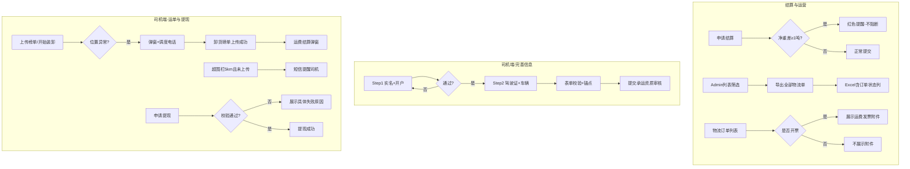
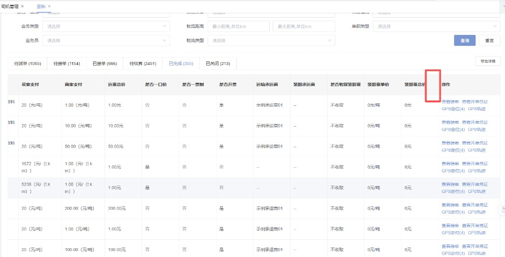

| 文档版本 | 日期 | 撰写人 | 修改描述 |
| --- | --- | --- | --- |
| V1.0 | 2026年07月09日 | — | PRD 初稿，整理 7 项物流零碎需求 |

## 1. 背景和目标

### 1.1 背景

2026 年 7 月，粮巴巴物流业务在 **结算校验、运营导出、司机 onboarding、运单履约、提现体验、财务开票** 等环节存在若干体验与效率痛点，分散于 Admin 后台、钉钉端与司机端多个页面：

1. **结算侧**：豆粕、玉米、预混料干线/末端物流申请结算时，装卸货磅单净重与提货单/发货单基准净重偏差较大，缺少提交前预警，易产生错误结算。
2. **运营侧**：干线物流订单列表「导出详情」仅覆盖当前 Tab/列表，无法按筛选项一次性导出全量物流单；列表缺少运费发票附件查看入口。
3. **司机侧**：完善信息页字段堆叠过长，提交校验不明确；位置异常弹窗无派车调度电话；卸货后缺少结算提醒；超围栏无短信触达；提现失败原因模糊。

上述问题影响结算准确性、运营效率及司机端转化率，需在 7 月迭代中集中交付。

### 1.2 目标

1. **降低结算差错**：净重偏差 ≥ 1 吨时提交前红色提醒，减少错误结算。
2. **提升运营效率**：支持按筛选项导出全部物流单，列表可直接查看运费发票附件。
3. **优化司机体验**：完善信息分步引导、表单校验锚点、位置/结算/提现提示可理解、可操作。
4. **增强可联系性**：位置异常、超距、结算环节展示派车调度电话，支持一键拨打。

**范围：** 品类豆粕/玉米/预混料；终端 Admin 后台、钉钉、司机端 APP/小程序/H5。  
**不在范围：** 运费计价规则变更、电子围栏半径配置变更（5km 短信为新增触达能力）。

---

## 2. 需求方案

### 2.1 功能流程图



### 2.2 需求列表

| 分类（产品模块） | 主要功能点 | 功能点拆分 | 优先级 |
| --- | --- | --- | --- |
| 结算管理 | 装卸货净重校验 | 基准净重取值（提货单/发货单）<br/>差值≥1吨红色提醒<br/>装货/卸货分2条提醒<br/>钉钉+Admin双端 | P0 |
| 干线物流运营 | 导出全部物流单 | 新增【导出全部物流单】按钮<br/>按筛选项导出全量订单<br/>新增订单状态列<br/>待结算导出子状态 | P1 |
| 司机资质 | 完善信息表单校验 | 提交时全量必填校验<br/>红色提醒<br/>锚点定位首个问题字段<br/>折叠模块自动展开 | P0 |
| 司机资质 | 完善信息分步流程 | Step1 实名认证+开户<br/>Step2 驾驶证+车辆信息<br/>断点续填<br/>关联R3校验 | P0 |
| 司机运单 | 装卸榜单与位置提醒 | 位置异常弹窗加调度电话<br/>卸货后运费结算弹窗<br/>超围栏5km短信提醒 | P1 |
| 司机钱包 | 提现失败原因展示 | 账号/代收禁用<br/>锡商/上银未开通或冻结<br/>后端错误码映射 | P1 |
| 物流财务 | 物流运费发票字段 | 列表新增运费发票列<br/>已开票展示附件<br/>未开票不展示 | P1 |

### 2.3 交互图

**结算净重校验**

申请结算 → 读取基准净重（提货单装货净重 / 发货单货物净重）→ 计算装货/卸货差值 → ≥1吨展示红色提醒 → 用户确认后可继续提交

**导出全部物流单**

Admin 列表设置筛选项 → 点击【导出全部物流单】→ 忽略状态Tab导出全量 → 下载 Excel（导出详情字段 + 订单状态）

**完善信息分步**

进入完善信息 → Step1 身份证+实名手机号+开户 → 【下一步】→ Step2 驾驶证+车辆+挂车证件 → 【同意提供上述信息进行审核】→ 校验通过 → 提交审核

**司机运单触达**

位置异常 → 【重要提示】弹窗含调度电话 → 卸货磅单上传成功 → 【运费结算提示】弹窗 → 超5km未上传榜单 → 短信提醒

**提现**

【申请提现】→ 后端校验 → 失败展示具体原因（禁用/冻结/未开户等）→ 停留当前页可重试

---

## 3、需求明细

| 页面 | 逻辑 |
| --- | --- |
| **R1 装卸货净重校验**<br/>Admin 后台<br/><br/>钉钉端<br/> | **1. 适用范围**<br/>品类：豆粕、玉米、预混料；物流类型：干线+末端；终端：Admin、钉钉；触发：提交「申请结算」时。<br/><br/>**2. 基准净重**<br/>优先级1：存在提货单 → 提货单 **装货净重**；优先级2：无提货单仅有发货单 → 发货单 **货物净重**。<br/><br/>**3. 校验规则**<br/>装货差值 = \|装货磅单净重 - 基准净重\|；卸货差值同理。任一差值 **≥ 1 吨**（含等于）触发红色提醒。<br/><br/>**4. 提醒文案（分2条独立展示）**<br/>有提货单：装货超差「装货磅单净重与提货单装货净重相差 ≥ 1 吨，请确认后提交」；卸货超差同理；均超差则2条同时展示。<br/>无提货单：文案中「提货单装货净重」替换为「发货单货物净重」。<br/><br/>**5. 交互**<br/>红色文字/提示条，位于装卸货模块底部；**不阻断提交**；Admin 编辑净重建议即时校验；申请结算时再次校验。<br/><br/>**6. 已确认**<br/>双超差分2条；阈值≥1吨含等于；无提货单取发货单货物净重。 |
| **R2 导出全部物流单**<br/>Admin · 干线物流订单列表<br/> | **1. 入口**<br/>列表页右上方，「导出详情」按钮 **左侧** 新增【导出全部物流单】。<br/><br/>**2. 导出范围**<br/>按当前页面 **全部筛选项** 查询，导出符合条件的 **全部物流订单**；**不受** 当前状态 Tab、分页限制。<br/><br/>**3. 导出字段**<br/>与各品类现有「导出详情」字段 **完全一致**，新增 **订单状态** 列。豆粕/玉米/预混料各自独立模板，分别沿用对应品类字段。<br/><br/>**4. 订单状态枚举**<br/>待派单、待接单、已接单、待提交、待审核、审核通过、已完成、已关闭。待结算阶段导出 **子状态**（待提交/待审核/审核通过），不导出「待结算」父状态。<br/><br/>**5. 交互**<br/>导出格式 Excel，与现有导出一致；无数据提示「暂无符合条件的数据」；大数据量沿用现有异步导出机制。<br/><br/>**6. 已确认**<br/>不同品类不同模板；待结算用子状态；字段=导出详情+订单状态列。 |
| **R3 完善信息 · 表单校验**<br/><br/> | **1. 入口**<br/>完善信息页，点击【同意提供上述信息进行审核】或 Step1【下一步】（见 R7）。<br/><br/>**2. 校验顺序（自上而下，首个失败即锚点）**<br/>① 身份证：人像面/国徽面、姓名、身份证号、登录/实名手机号<br/>② 驾驶证：正页/副页<br/>③ 车辆：至少1辆及必填子项、默认车辆<br/>④ 挂车证件：挂车行驶证、道路运输证、三人车合影（条件必填待确认）<br/>⑤ 协议勾选<br/><br/>**3. 失败处理**<br/>字段下方红色提醒；页面平滑滚动至 **第一个** 问题字段/模块；折叠车辆模块 **先展开** 再定位；**阻断提交**。<br/><br/>**4. 关联**<br/>R7 分步后，Step1 校验 Step1 字段；Step2 提交校验 Step2 全部字段。 |
| **R4 装卸榜单与位置提醒**<br/>位置异常弹窗<br/><br/>运单列表<br/> | **1. 位置异常弹窗加调度电话**<br/>触发：上传装卸榜单 / 开始装货/卸货时 GPS 位置异常。<br/>改造：现有「【重要提示】」弹窗文案下方增加 **派车调度电话：{phone}**，支持 **点击拨打**（tel:）。电话取 **当前运单** 派车调度电话，非平台统一号码。<br/><br/>**2. 卸货磅单上传后 · 运费结算弹窗**<br/>触发：卸货磅单 **上传成功** 后。<br/>内容：提醒进入运费结算流程，展示派车调度电话，【我知道了】关闭。每单 **仅弹 1 次**。<br/><br/>**3. 超电子围栏 5 公里 · 短信**<br/>触发：距装/卸货点 **> 5km** 且装货/卸货磅单 **未上传**。<br/>方式：短信至司机登录手机号；内容含运单号、装/卸环节、调度电话。频次待确认（建议同单同环节 24h 限 1 条）。<br/><br/>**4. 待确认**<br/>调度电话为空是否 fallback 平台电话；装/卸短信分开发或合并；结算弹窗是否每次保存均弹。 |
| **R5 申请提现失败原因**<br/> | **1. 入口**<br/>司机端提现页，点击【申请提现】，后端校验不通过时触发。<br/><br/>**2. 展示规则**<br/>Toast/弹窗沿用现有失败样式，文案必须为 **具体业务原因**，禁止统一「提现失败」吞掉真实原因。<br/><br/>**3. 失败原因与文案**<br/>账号禁用 → 账号已禁用，无法提现，请联系客服<br/>代收账号禁用 → 代收账号已禁用，无法提现，请联系客服<br/>未开通锡商 → 未开通锡商银行账户，无法提现<br/>锡商账户冻结 → 锡商账户已冻结，无法提现，请联系客服<br/>上银账户冻结 → 上海银行账户已冻结，无法提现，请联系客服<br/>余额不足 → 可用余额不足，无法提现<br/>其他 → 展示后端 message<br/><br/>**4. 接口建议**<br/>错误码：ACCOUNT_DISABLED、COLLECT_ACCOUNT_DISABLED、NO_XISHANG_ACCOUNT、XISHANG_FROZEN、SHANGHAI_BANK_FROZEN 等。<br/><br/>**5. 交互**<br/>失败不跳转，停留当前页可修改金额后重试；多原因命中展示优先级最高一条（后端定义）。 |
| **R6 物流运费发票字段**<br/>Admin · 物流订单列表<br/> | **1. 入口**<br/>Admin 豆粕/玉米/预混料 **物流订单列表**，「操作」列 **左侧** 新增列 **物流运费发票**（可简称「运费发票」）。<br/><br/>**2. 展示规则**<br/>是否开票 = **是** → 展示发票 **附件**（预览/下载）；是否开票 = **否** → **不展示** 附件，显示「—」。逻辑与现有「是否开票」字段一致。<br/><br/>**3. 范围**<br/>各状态 Tab 均展示该列；末端物流是否同步待确认。<br/><br/>**4. 待确认**<br/>多附件展示方式；导出是否含发票列；已开票无附件异常数据展示。 |
| **R7 完善信息 · 分步流程**<br/>现状（拆分前）<br/><br/>Step2 车辆信息<br/><br/>Step2 挂车证件与提交<br/> | **1. 整体流程**<br/>进入完善信息 → **Step1 实名认证+开户** → 通过 → **Step2 驾驶证+车辆信息** → 提交审核（R3 校验）。<br/><br/>**2. Step1 · 实名开户**<br/>字段：身份证人像面/国徽面（OCR）、姓名、身份证号、登录手机号（只读）、实名手机号（调取验证，须本人实名）。<br/>逻辑：实名通过 → 触发锡商/上银开户 → 成功方可进入 Step2；Step1 未完成 **不可跳过**。<br/>按钮：【下一步】/【完成实名并继续】；失败红色提醒+锚点（同 R3）。<br/><br/>**3. Step2 · 驾驶证+车辆**<br/>驾驶证正/副页；车辆信息（车牌、车型、质量、挂车证件等）；三人车合影；协议勾选；提交【同意提供上述信息进行审核】。<br/>顶部步骤指示：「1 实名开户 → 2 完善资质」。<br/><br/>**4. 断点续填**<br/>Step1 完成、Step2 未完成 → 再次进入默认 Step2；Step1 未完成 → 仅展示 Step1；审核驳回 → 定位对应步骤模块。<br/><br/>**5. 待确认**<br/>Step2 期间是否允许回改 Step1；开户失败是否阻断全流程；实名手机号是否必须短信验证码；车辆最多几辆。 |

---

## 4. 数据统计

### 4.1 核心指标（建议）

| 指标名称 | 定义 | 计算口径 | 统计周期 | 备注 |
| --- | --- | --- | --- | --- |
| 净重超差提醒触发率 | 申请结算时触发 ≥1吨 提醒的占比 | 触发提醒单数 / 申请结算单数 | 周 | R1 |
| 导出全部物流单使用量 | 使用新导出功能的次数 | 点击【导出全部物流单】次数 | 周 | R2 |
| 完善信息 Step1 转化率 | 进入 Step1 后完成开户的比例 | Step1 完成人数 / 进入 Step1 人数 | 周 | R7 |
| 完善信息提交成功率 | 点击提交且校验通过的比例 | 提交成功次数 / 点击提交次数 | 周 | R3/R7 |
| 位置异常弹窗调度电话拨打率 | 弹窗展示后点击拨打的比例 | 拨打次数 / 弹窗展示次数 | 周 | R4 |
| 提现失败原因分布 | 各失败原因码占比 | 按错误码分组计数 | 周 | R5 |

### 4.2 导出字段补充（R2）

在现有「导出详情」字段基础上，新增：

| 字段名 | 说明 |
| --- | --- |
| 订单状态 | 待派单/待接单/已接单/待提交/待审核/审核通过/已完成/已关闭 |

### 4.3 列表字段补充（R6）

| 字段名 | 说明 |
| --- | --- |
| 物流运费发票 | 已开票展示附件链接；未开票为空或「—」 |

### 4.4 待确认项汇总

| 需求 | 待确认 |
| --- | --- |
| R3 | 车辆子字段清单、是否强制默认车辆、无挂车是否跳过挂车证件 |
| R4 | 调度电话 fallback、短信频次、装/卸分开、结算弹窗频次 |
| R5 | 未开通上银文案、多原因优先级、客服电话 |
| R6 | 末端物流、多附件、导出、异常数据 |
| R7 | Step1 回改、开户失败阻断、验证码、多车上限 |

---

## 5. 附录 · 需求依赖关系

```
R7（分步流程）──→ R3（Step1/Step2 提交校验）
R2（导出全部）──→ 与 R6（发票列）导出字段可后续对齐
R4（位置提醒）──→ 依赖运单「派车调度电话」字段
```
