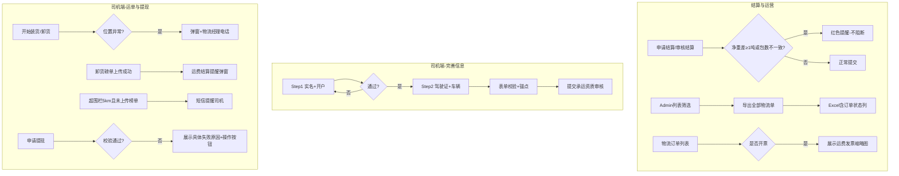
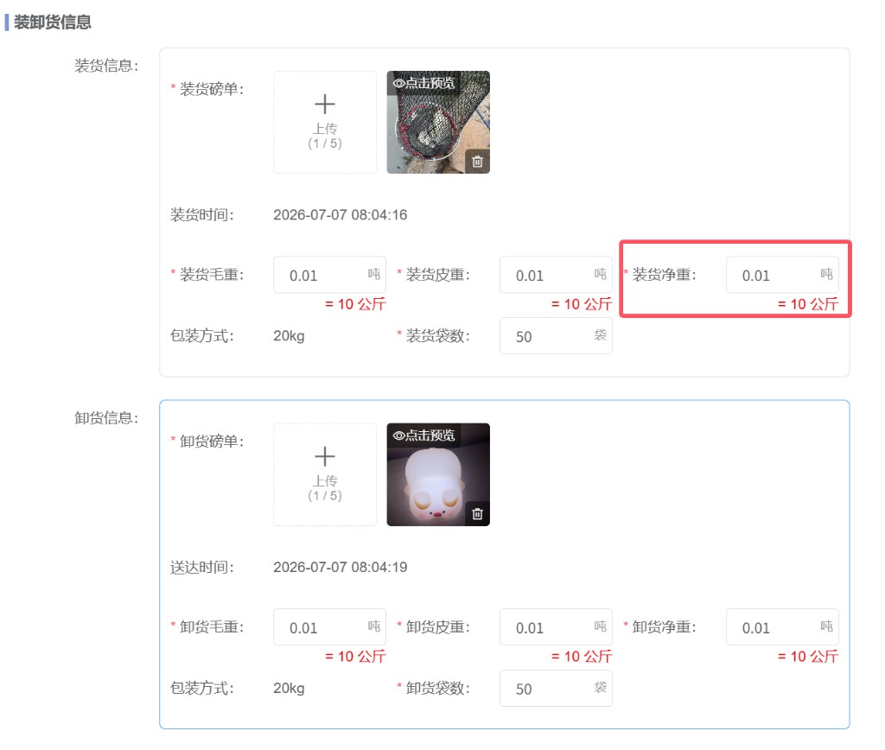
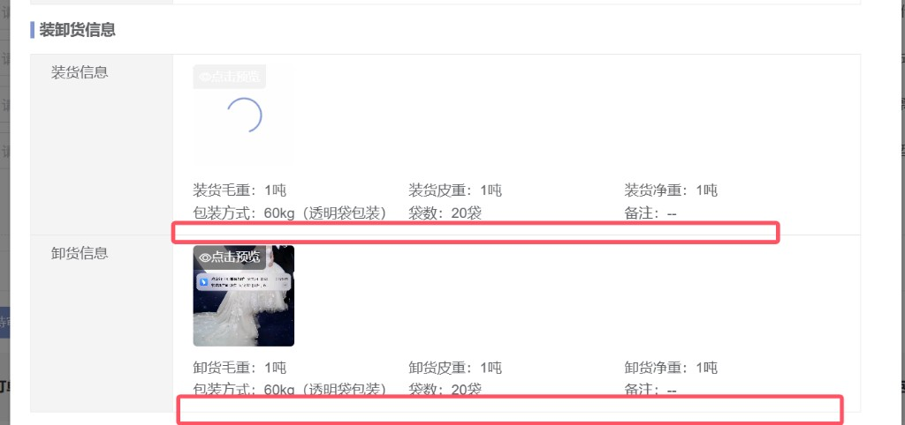
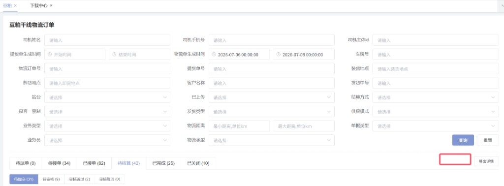
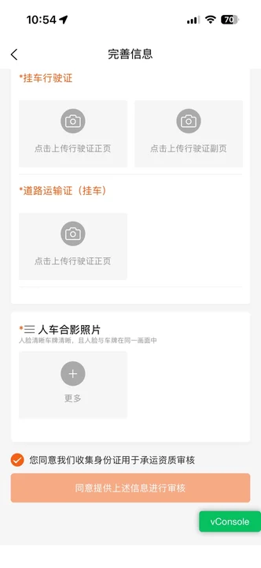
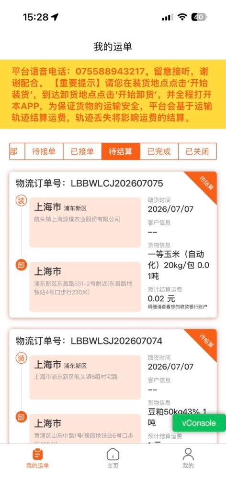
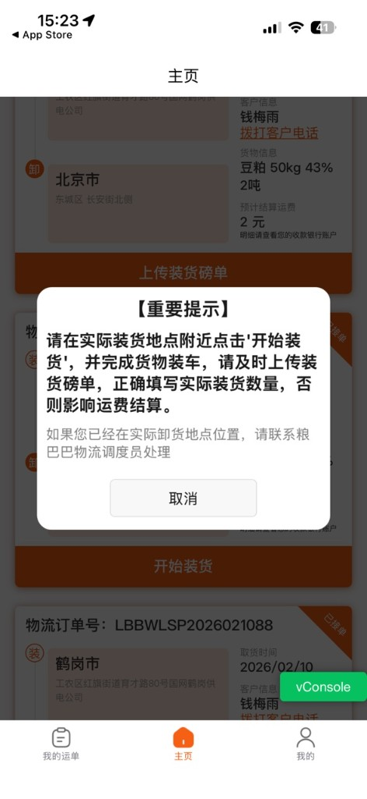
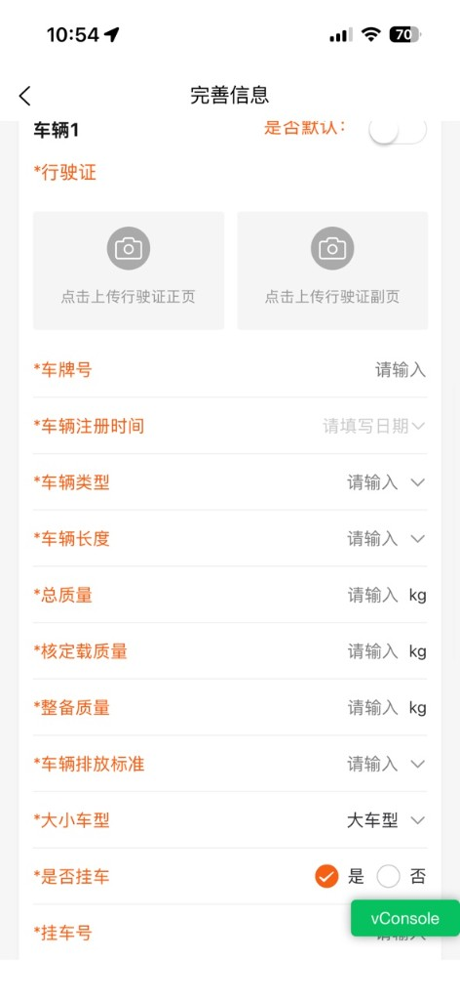

| 文档版本 | 日期 | 撰写人 | 描述 |
| --- | --- | --- | --- |
| V1.0 | 2026年07月09日 | 方伟萍 | 物流零碎需求初稿 |
| V1.1 | 2026年07月11日 | 方伟萍 | 查漏补缺：补全 R 编号、缺失需求项、车辆字段、待确认汇总 |

## 1. 背景和目标

### 1.1 背景

2026 年 7 月，粮巴巴物流业务在 **结算校验、运营导出、司机沟通、运单履约、提现体验、财务开票** 等环节存在若干体验与效率痛点，分散于 Admin 后台、钉钉端与司机端多个页面：

1. **钉钉和 Admin 后台物流侧**：豆粕、玉米、预混料干线/末端物流申请结算以及审核结算时，装卸货磅单净重与提货单/发货单基准净重偏差较大，且存在包数不一致情况，缺少提交前预警，易产生错误结算。
2. **Admin 物流订单列表**：干线/末端/鸡蛋物流订单列表「导出详情」仅覆盖当前 Tab/列表，无法按筛选项一次性导出全量物流单；列表缺少运费发票附件查看入口。
3. **司机侧**：完善信息页字段堆叠过长，一次性提交后若手机号等信息不正确会导致整单提交失败；字段填写异常弹窗无派车调度电话；卸货后缺少结算联系人提醒；超围栏无短信触达；提现失败原因模糊，需人工查询。

上述问题影响结算准确性、运营和技术效率及司机端体验，需尽快优化。

### 1.2 目标

1. **降低结算差错**：净重偏差 ≥ 1 吨或包数不一致时提交前红色提醒，减少错误结算，提升运营效率。
2. **提升运营效率**：支持按筛选项导出全部物流单，列表可直接查看运费发票附件。
3. **优化司机体验**：完善信息分步引导、表单校验锚点、位置/结算/提现提示可理解、可操作。
4. **增强可联系性**：位置异常、运单卡片、结算及提现失败环节展示物流经理/调度电话，支持一键拨打。

**范围：** 品类豆粕/玉米/预混料；物流类型干线+末端+鸡蛋；终端 Admin 后台、钉钉、司机端 APP/小程序/H5、众包方完善信息页。

**不在范围：** 运费计价规则变更、电子围栏半径配置变更（5km 短信为新增触达能力）。

---

## 2. 需求方案

### 2.1 功能流程图



### 2.2 需求列表

| 编号 | 分类（产品模块） | 主要功能点 | 功能点拆分 | 优先级 |
| --- | --- | --- | --- | --- |
| R1 | 钉钉和 Admin 后台 | 装卸货净重与包数校验 | 提货单/发货单基准比对<br/>净重差≥1吨红色提醒<br/>包数不一致红色提醒<br/>装货/卸货分条提醒<br/>提交审核页+审核页均生效 | P0 |
| R2 | 干线/末端/鸡蛋物流订单列表 | 导出全部物流单 | 新增【导出全部物流单】<br/>按筛选项导出全量订单<br/>新增订单状态列<br/>末端【数据导出】改为导出全部 | P1 |
| R3 | 司机 APP 注册 | 完善信息表单校验 | 提交时全量必填校验<br/>红色提醒+锚点定位首个问题字段<br/>折叠模块先展开再定位<br/>关联 R7 分步 | P0 |
| R4 | 司机运单 | 装卸榜单与位置提醒 | 位置异常弹窗加物流经理电话<br/>运单卡片展示派车员电话<br/>卸货后运费结算提醒弹窗<br/>超围栏 5km 短信（待确认） | P0 |
| R5 | 司机钱包 | 提现失败原因展示 | 账号/代收禁用、锡商/上银未开通或冻结等<br/>具体文案+操作按钮（去联系/去更新/暂不更新） | P0 |
| R6 | 干线物流订单列表 | 物流运费发票字段 | 列表新增发票快照列<br/>已开票展示缩略图<br/>新增筛选项：全部/已开票/未开票 | P1 |
| R7 | 司机 APP 注册 | 完善信息分步流程 | Step1 实名认证+开户<br/>Step2 驾驶证+车辆信息<br/>断点续填 | P0 |
| — | 众包方 | 完善信息（身份证） | 身份证上传+OCR回填<br/>实名手机号校验<br/>【验证信息】按钮 | P1 |

### 2.3 交互图

**结算净重校验：** 申请结算/审核 → 读取提货单/发货单基准 → 比对装卸货净重与包数 → 命中规则展示红色提醒 → 不阻断提交

**导出全部物流单：** Admin/末端列表设置筛选项 → 点击【导出全部物流单】→ 导出全状态订单 → 下载 Excel（原导出详情字段 + 订单状态）

**完善信息分步：** 进入完善信息 → Step1 身份证+实名手机号+开户 → 【下一步】→ Step2 驾驶证+车辆+挂车证件 → 【同意提供上述信息进行审核】→ 校验通过 → 提交

**司机运单触达：** 位置异常 → 【重要提示】弹窗含物流经理电话 → 我的运单卡片展示派车员电话 → 卸货磅单上传成功 → 结算提醒弹窗

**提现失败：** 【申请提现】→ 后端校验失败 → 弹窗展示具体原因 → 【去联系】/【去更新】/【暂不更新】

---

## 3、需求明细

| 需求 | 页面 | 逻辑 |
| --- | --- | --- |
| **R1** | Admin 后台<br/><br/>钉钉端<br/><br/>Admin 审核页 | **1. 适用范围**<br/>品类：豆粕、玉米、预混料；物流类型：干线+末端；终端：钉钉、Admin；触发：**提交审核页面、审核页面** 申请/审核结算时。<br/><br/>**2. 基准取值**<br/>存在提货单 → 比对提货单净重、包数；仅有发货单 → 比对发货单净重、包数。<br/><br/>**3. 校验规则**<br/>① 净重：装卸货磅单净重与基准净重差值绝对值 **≥ 1 吨** → 提醒。<br/>② 包数：装卸货磅单包数与基准包数不一致 → 提醒。<br/>③ 装货、卸货 **分别判断**，命中多条则 **分条展示**。<br/><br/>**4. 提醒文案（提货单）**<br/>仅净重超差：上传的装货/卸货磅单净重与提货吨数差值超过 1 吨，请确认后再提交。<br/>仅包数不一致：上传的装货/卸货磅单包数不一致，请确认后提交。<br/>均命中：净重超差 **且** 包数不一致（合并一条或分两条，与研发确认展示）。<br/>发货单场景：文案中「提货单」改为「发货单」。<br/><br/>**5. 交互**<br/>红色提醒，位于装卸货模块；**不阻断** 提交审核和审核操作；钉钉端同步。 |
| **R2** | 干线物流<br/><br/>末端物流、鸡蛋物流列表 | **1. 入口**<br/>豆粕干线、玉米预混料干线、末端、**鸡蛋** 物流订单列表；「导出详情」后增加【导出全部物流单】。末端原【数据导出】改为【导出全部物流单】。<br/><br/>**2. 导出范围**<br/>按当前页面 **全部筛选项** 导出符合条件的全部物流订单，**含各状态**，不受 Tab/分页限制。<br/><br/>**3. 导出字段**<br/>与各品类现有「导出详情」字段一致，**新增订单状态列**。枚举：待派单、待接单、已接单、待提交、待审核、审核通过、已完成、已关闭。待结算阶段导出 **子状态**（待提交/待审核/审核通过）。<br/><br/>**4. 交互**<br/>无数据提示「暂无符合条件的数据」；大数据量沿用现有异步导出机制。 |
| **R6** | 豆粕/玉米预混料干线订单列表 | **1. 列表列**<br/>操作列左侧新增 **物流运费发票** 列：已开票显示缩略图，未开票不显示；点击缩略图打开发票页面。<br/><br/>**2. 筛选项**<br/>新增「发票」筛选项（全局生效）：全部、已开票、未开票。<br/><br/>**3. 数据来源**<br/>发票数据可从承运商后台或交易侧取值（待研发确认）。<br/><br/>**4. 待确认**<br/>末端物流是否同步；多附件展示方式；导出是否含发票列。 |
| **R3** | 司机端完善信息<br/><br/><br/>原型：完善信息-合并.html | **1. 入口**<br/>完善信息页点击【同意提供上述信息进行审核】或 Step1【下一步】（见 R7）。页面分为两步填写（R7）。<br/><br/>**2. 校验顺序（自上而下，首个失败即锚点）**<br/>① 身份证：人像面/国徽面、姓名、身份证号、登录/实名手机号<br/>② 驾驶证：正页/副页<br/>③ 车辆：至少 1 辆、默认车辆、必填子项（见 R7 字段清单）<br/>④ 挂车证件（是否挂车=是时）：挂车行驶证、道路运输证、人车合影<br/>⑤ 协议勾选<br/><br/>**3. 失败处理**<br/>字段下方红色提醒；平滑滚动至 **第一个** 问题字段/模块；折叠车辆模块 **先展开** 再定位；**阻断提交**。<br/><br/>**4. 关联**<br/>Step1 仅校验 Step1 字段；Step2 提交校验 Step2 全部字段。 |
| **R4** | 司机端运单<br/><br/><br/>原型：司机端-主页-位置异常弹窗.html、司机端-我的运单.html | **1. 位置异常弹窗加物流经理电话**<br/>触发：开始装货/开始卸货、GPS 位置异常时现有【重要提示】弹窗。<br/>改造：文案下方增加「如果您已经在实际卸货地点位置，请联系粮巴巴物流经理：{phone}」，支持点击拨打（tel:）。电话取 **当前运单** 派车调度电话。<br/><br/>**2. 运单卡片增加派车员电话**<br/>我的运单/主页运单卡片展示「物流经理联系电话：{phone}」，点击唤起呼叫。<br/><br/>**3. 卸货磅单上传后 · 运费结算提醒**<br/>触发：卸货磅单上传成功后。<br/>内容：提醒进入运费结算流程，展示物流经理电话，【我知道了】关闭；每单仅弹 1 次（频次待确认）。<br/><br/>**4. 超电子围栏 5 公里 · 短信（待确认）**<br/>触发：距装/卸货点 > 5km 且对应磅单未上传；短信至司机登录手机号，含运单号、环节、调度电话。 |
| **R5** | 司机端提现<br/>原型：司机端-提现.html、diagram.html | **1. 入口**<br/>司机端提现页点击【申请提现】，后端校验不通过时触发。<br/><br/>**2. 展示规则**<br/>禁止统一「提现失败」；必须展示 **具体业务原因**；停留当前页可重试。<br/><br/>**3. 失败原因与文案**<br/>账号禁用 → 您的账号被禁用，不能提现，请联系您的物流经理，电话：{phone}；操作：【取消】【去联系】<br/>代收账号禁用 → 代收账号已禁用，无法提现，请联系客服<br/>未开通锡商 → 未开通锡商银行账户，无法提现<br/>锡商账户冻结 → 锡商账户已冻结，无法提现，请联系客服<br/>上银账户冻结 → 您的上银账号已冻结，不能提现，请更新身份证信息；操作：【暂不更新】【去更新】<br/>余额不足 → 可用余额不足，无法提现<br/>其他 → 展示后端 message<br/><br/>**4. 接口建议**<br/>错误码：ACCOUNT_DISABLED、COLLECT_ACCOUNT_DISABLED、NO_XISHANG_ACCOUNT、XISHANG_FROZEN、SHANGHAI_BANK_FROZEN 等。 |
| **R7** | 司机端完善信息<br/><br/><br/><br/>原型：完善信息-合并.html | **1. 整体流程**<br/>进入完善信息 → **Step1 实名认证+开户** → 通过 → **Step2 驾驶证+车辆信息** → 提交审核（R3 校验）。顶部步骤指示：「1 实名开户 → 2 完善资质」。<br/><br/>**2. Step1 · 实名开户**<br/>字段：身份证人像面/国徽面（OCR）、姓名、身份证号、登录手机号（只读）、实名手机号（须本人实名）。<br/>逻辑：实名通过 → 触发锡商/上银开户 → 成功方可进入 Step2；不可跳过。<br/>按钮：【下一步】；失败红色提醒+锚点。<br/><br/>**3. Step2 · 驾驶证+车辆**<br/>驾驶证正/副页；车辆信息；挂车证件（条件展示）；协议勾选；提交【同意提供上述信息进行审核】。<br/><br/>**4. 车辆1 必填字段清单**<br/>行驶证（正页/副页）、车牌号、车辆注册时间、车辆类型、车辆长度、总质量(kg)、核定载质量(kg)、整备质量(kg)、车辆排放标准、大小车型、是否挂车、挂车号（是时必填）；是否默认开关；支持【新增车辆】。<br/><br/>**5. 挂车证件（是否挂车=是）**<br/>挂车行驶证（正/副页）、道路运输证（挂车）、人车合影照片。<br/><br/>**6. 断点续填**<br/>Step1 完成、Step2 未完成 → 默认进入 Step2；Step1 未完成 → 仅 Step1；审核驳回 → 定位对应步骤。<br/><br/>**7. 待确认**<br/>Step2 是否允许回改 Step1；开户失败是否阻断；实名手机号是否短信验证；车辆上限。 |
| **众包方** | 众包方完善信息<br/>原型：众包方-完善信息.html | **1. 适用范围**<br/>众包方司机/承运方注册完善信息，仅身份证模块（与全职司机 Step1 字段一致）。<br/><br/>**2. 字段**<br/>身份证人像面/国徽面、姓名、身份证号、登录手机号（只读）、实名手机号；提示「实名手机号必须为本人实名认证」。<br/><br/>**3. 操作**<br/>协议勾选后【验证信息】可点击（按钮色 #FF8533）；已上传显示绿色完成标识；支持删除重传。 |

---

## 4. 数据统计

| 指标名称 | 定义 | 计算口径 | 统计周期 | 备注 |
| --- | --- | --- | --- | --- |
| 净重/包数超差提醒触发率 | 申请结算时触发提醒的占比 | 触发提醒单数 / 申请结算单数 | 周 | R1 |
| 导出全部物流单使用量 | 使用新导出功能的次数 | 点击【导出全部物流单】次数 | 周 | R2 |
| 完善信息 Step1 转化率 | 进入 Step1 后完成开户的比例 | Step1 完成人数 / 进入 Step1 人数 | 周 | R7 |
| 完善信息提交成功率 | 点击提交且校验通过的比例 | 提交成功次数 / 点击提交次数 | 周 | R3/R7 |
| 位置异常弹窗电话拨打率 | 弹窗展示后点击拨打的比例 | 拨打次数 / 弹窗展示次数 | 周 | R4 |
| 提现失败原因分布 | 各失败原因码占比 | 按错误码分组计数 | 周 | R5 |

### 4.1 待确认项汇总

| 需求 | 待确认 |
| --- | --- |
| R1 | 净重与包数双命中时合并一条还是两条提醒 |
| R2 | 鸡蛋物流导出字段是否与干线模板一致 |
| R3/R7 | 无挂车时是否跳过挂车证件；是否强制默认车辆 |
| R4 | 调度电话为空是否 fallback 平台电话；短信频次；结算弹窗是否每次保存均弹 |
| R5 | 物流经理电话取值来源；多原因命中优先级 |
| R6 | 末端物流是否同步发票列；多附件展示 |
| R7 | Step1 回改、开户失败阻断、验证码、多车上限 |

### 4.2 需求依赖关系

```
R7（分步流程）──→ R3（Step1/Step2 提交校验）
R2（导出全部）──→ 与 R6（发票列）导出字段可后续对齐
R4（位置提醒）──→ 依赖运单「派车调度电话/物流经理电话」字段
R5（提现失败）──→ 上银冻结引导回完善信息（R7 Step1）
```

### 4.3 原型文件索引

| 原型 | 路径 |
| --- | --- |
| 完善信息（合并） | 完善信息-合并.html |
| 众包方完善信息 | 众包方-完善信息.html |
| 位置异常弹窗 | 司机端-主页-位置异常弹窗.html |
| 我的运单 | 司机端-我的运单.html |
| 提现/冻结提醒 | 司机端-提现.html、diagram.html |
