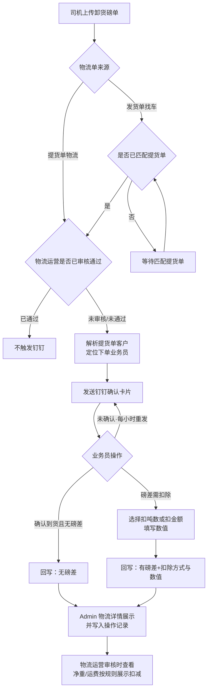

# 【需求】业务员确认磅单

| 文档版本 | 日期 | 撰写人 | 修改描述 |
| ---- | --- | --- | --- |
| V1.0 | 2026年07月24日 | — | PRD 初稿 |

---

## 1. 背景和目标

### 1.1 背景

客户提货单 / 发货单产生的物流单，经物流派单、司机接单并上传**卸货磅单**后，装卸货净重常存在磅差。当前物流运营审核时缺少「下单业务员」对到货与磅差的确认结论，扣吨 / 扣运费口径不清晰，易产生对账争议。

### 1.2 目标

1. 卸货磅单就绪且满足触发条件时，自动钉钉通知对应**下单业务员**确认到货与磅差  
2. 业务员可选择「无磅差」或「磅差需扣除」（扣金额 **或** 扣吨数，二选一）  
3. 确认结果回写 Admin 物流单，供物流运营审核查看，并参与卸货净重 / 运费扣减展示  
4. 物流已审核通过的单据**不再**重复触发通知  

### 1.3 目标用户

| 角色 | 用途 |
| --- | --- |
| 下单业务员 | 接收钉钉卡片并确认 |
| 物流运营 | Admin 审核时查看业务员确认结果 |
| 司机 | 上传卸货磅单（既有能力，本需求不改司机端） |

### 1.4 名词释义

| 名词 | 说明 |
| --- | --- |
| 提货单物流 | 由提货单创建的物流单 |
| 发货单找车 | 发货侧找车产生的物流单，需匹配提货单后才通知业务员 |
| 下单业务员 | 提货单对应客户关联的下单业务员 |
| 装卸货磅差 | 装货净重 − 卸货净重（展示口径见明细；正负均需展示） |
| 磅差扣除 | 业务员选择按**金额**或按**吨数**扣除，二者仅可选其一 |

---

## 2. 需求方案

### 2.1 功能流程图



### 2.2 需求列表

| 分类（产品模块） | 主要功能点 | 功能点拆分 | 优先级 |
| --- | --- | --- | --- |
| 触发与通知 | 自动发钉钉卡片 | 提货单物流触发<br/>发货单找车匹配后触发<br/>已审核通过不重复触发<br/>定位下单业务员 | P0 |
| 钉钉卡片 | 业务员确认 | 展示客户/单号/品类/装卸磅单/磅差<br/>【确认到货且无磅差】<br/>【磅差需扣除】弹窗二选一填写 | P0 |
| Admin 物流详情 | 结果展示与扣减 | 业务员确认结果字段<br/>操作记录「业务员已确认」<br/>卸货净重扣吨 / 运费扣金额展示 | P0 |
| 异常与边界 | 防重与兜底 | 重复上传不重复扰<br/>业务员离职/空缺兜底<br/>卡片失效策略 | P1 |

### 2.3 交互图

```text
司机上传卸货磅单
  →（提货单物流 / 发货单已匹配提货单）且物流未审核通过
  → 钉钉工作通知 · 业务员确认磅单
  → 【确认到货且无磅差】→ 成功回写 → 卡片置为已确认
  → 【磅差需扣除】→ 选择「扣除金额」或「扣除吨数」→ 填写数值 → 提交
  → Admin 物流详情可见确认结果与操作记录
  → 物流运营审核
```

---

## 3. 需求明细

### 3.1 触发规则

| 页面 | 逻辑 |
| --- | --- |
| **触发时机** | **1. 入口 / 触发条件（须同时满足）**<br/>① 物流单已存在卸货磅单（司机已上传）<br/>② 物流运营**尚未审核通过**（已通过则永不触发本通知）<br/>③ 能定位到提货单及对应下单业务员<br/><br/>**2. 分场景**<br/>· **提货单产生的物流单**：卸货磅单上传成功后立即评估触发<br/>· **发货单找车**：卸货磅单上传后若**未匹配提货单**，不发卡片；匹配提货单成功后再触发<br/><br/>**3. 防重**<br/>· 同一物流单同一业务员：有效确认前最多保留 1 张待办卡片；重复上传卸货磅单 → **更新卡片数据**，不另发多条（【待确认】是否短信/另通道提醒）<br/>· 业务员已确认后：不再因磅单微调自动重发（【待确认】磅单被覆盖是否允许再次确认）<br/><br/>**4. 接收人**<br/>· 提货单客户对应的**下单业务员**钉钉账号<br/>· 找不到业务员 / 已离职：通知物流运营群或指定兜底人，并记操作记录「通知失败：无业务员」 |

### 3.2 钉钉卡片（业务员确认磅单）

> 样式参考：`trae/鸡窝卡片/考勤通知卡片.html`（白卡片、左 label 右 value、标题区分割线）；本需求**增加底部操作按钮**。  
> Demo：`trae/logisitic/物流提效/钉钉卡片-业务员确认磅单.html`

| 页面 | 逻辑 |
| --- | --- |
| **钉钉卡片** | **1. 入口**<br/>工作通知推送，点击打开卡片详情（或互动卡片内直接操作）<br/><br/>**2. 页面字段与规则** |

| 字段 | 规则 | 示例 |
| --- | --- | --- |
| 标题 | 固定：业务员确认磅单 | — |
| 客户名称 | 提货单客户名称 | 沁阳某某饲料 |
| 提货单号 | 可复制（可选） | TH20260724001 |
| 物流单号 | 展示便于核对 | LBDWLSP2023072345 |
| 品类 | 货物品类 | 豆粕 |
| 装货磅单-净重 | 装货净重，单位吨 | 10.00 吨 |
| 装货磅单-包数 | 有则展示，无则「—」 | 200 |
| 卸货磅单-净重 | 卸货净重，单位吨 | 9.85 吨 |
| 卸货磅单-包数 | 有则展示，无则「—」 | 197 |
| 装卸货磅差 | **装货净重 − 卸货净重**；为 0 显示 0.00 吨；非 0 橙色强调 | 0.15 吨 |

**3. 操作与跳转**

| 按钮 | 行为 |
| --- | --- |
| 【确认到货且无磅差】 | 二次确认（可选轻确认）后提交；结果=`无磅差`；扣除方式/数值为空 |
| 【有磅差需扣除】 | **二次确认弹窗** → 确认后弹出半屏：单选「扣除吨数」或「扣除金额」→ 输入对应数值（必填、>0）→【提交】；结果=`有磅差` |

**扣除填写规则**

| 项 | 规则 |
| --- | --- |
| 互斥 | 金额、吨数**只能选其一** |
| 扣除金额 | 单位：元；保留 2 位小数；上限【待确认，建议 ≤ 本单应付运费】 |
| 扣除吨数 | 单位：吨；保留 3 位小数；上限【待确认，建议 ≤ 卸货净重】 |
| 校验失败 | Toast 提示原因，不关闭弹窗 |

**4. 消息通知**：本卡片本身即为通知；提交成功 Toast「已确认」，卡片状态变为「已确认」，按钮置灰不可再点  

**5. 边界与异常**：见第 4 章  

**6. 数据字段**：见 5.3  

### 3.3 Admin · 物流订单详情

> 审核页布局参考现有「提交送货凭证对司机运费」页；本需求在详情中**新增**业务员确认区与操作记录。  
> Demo（提交/审核表单，对齐「提交送货凭证/司机运费」）：`trae/logisitic/物流提效/Admin-物流单详情-业务员确认磅单.html`  
> Demo（只读查看磅单表格样式）：`trae/logisitic/物流提效/Admin-查看磅单审核.html`  
> Demo（物流单详情，单据信息下增加业务员确认结果）：`trae/logisitic/物流提效/Admin-查看物流单详情.html`  
> Demo（H5 提交审核，业务员确认未确认/已确认两态）：`trae/logisitic/物流提效/H5-提交审核-卸货信息.html`  
> Demo（钉钉端查看磅单）：`trae/logisitic/物流提效/H5-查看磅单-钉钉端.html`

| 页面 | 逻辑 |
| --- | --- |
| **物流详情新增** | **1. 入口**<br/>Admin → 物流订单详情 / 送货凭证审核页<br/><br/>**2. 新增展示字段** |

| 字段 | 说明 |
| --- | --- |
| 业务员确认结果 | 未确认 / 确认到货且无磅差 / 磅差需扣除 |
| 扣除方式 | 无 / 扣除金额 / 扣除吨数 |
| 扣除数值 | 金额（元）或吨数（吨） |
| 确认业务员 | 姓名 |
| 确认时间 | yyyy-MM-dd HH:mm:ss |

**3. 操作记录**：新增一条「业务员已确认」，备注带上结果与扣除明细（如有）  

**4. 扣减展示规则（审核可见，是否自动改应付运费【待确认】）**

| 业务员选择 | 系统展示 |
| --- | --- |
| 无磅差 | 不扣减；卸货净重、运费按原值 |
| 扣除吨数 | 在**卸货磅单净重**上展示扣减：`确认后净重 = 卸货净重 − 扣除吨数`（不为负）；可备注「业务员确认扣吨」 |
| 扣除金额 | 在**运费（含装卸费）**上展示扣减：`确认后运费 = 原运费 − 扣除金额`（不为负）；可备注「业务员确认扣款」 |

**5. 与物流审核关系**  
· 业务员未确认：**不阻断**物流审核（【待确认】是否强制先确认）  
· 已确认：审核页醒目展示，便于运营采纳  

---

## 4. 边界异常场景

| 场景 | 处理 |
| --- | --- |
| 物流已审核通过后才上传/改磅单 | 不触发业务员钉钉 |
| 发货单找车未匹配提货单 | 不触发；匹配成功后再触发 |
| 装卸净重相等 | 仍可发卡片；业务员可点无磅差或仍选扣除（不强制） |
| 业务员重复点击提交 | 幂等：以首次成功为准 |
| 卡片已确认后再次打开 | 只读展示结果，无操作按钮 |
| 找不到下单业务员 | 记失败日志 + 通知兜底人 |
| 扣除数值超上限 / ≤0 | 前端拦截 + 后端校验 |
| 卸货磅单被删除 | 已发未确认卡片作废或标记失效【待确认】 |

---

## 5. 数据统计

### 5.1 核心指标

| 指标名称 | 定义 | 计算口径 | 统计周期 | 备注 |
| --- | --- | --- | --- | --- |
| 应确认单量 | 触发成功的物流单数 | 成功发送钉钉的去重物流单 | 日/周 | — |
| 确认完成率 | 已确认 / 应确认 | 业务员提交确认数 / 应确认单量 | 日/周 | — |
| 有磅差占比 | 选择扣除的单量占比 | 有磅差确认数 / 已确认数 | 周 | — |
| 平均确认时长 | 触发 → 确认 | 中位数建议同时报 | 周 | — |

### 5.2 埋点（如有）

| 事件 | 时机 |
| --- | --- |
| weight_confirm_card_send | 卡片发送成功 |
| weight_confirm_no_diff | 点击无磅差并成功 |
| weight_confirm_deduct_submit | 扣除提交成功（带 deduct_type） |
| weight_confirm_fail | 提交失败 |

### 5.3 回写字段（物流单）

| 字段 | 类型 | 说明 |
| --- | --- | --- |
| sales_confirm_status | enum | pending / no_diff / deduct |
| sales_deduct_type | enum | null / amount / ton |
| sales_deduct_value | decimal | 金额或吨数 |
| sales_confirm_user_id | string | 业务员 ID |
| sales_confirm_user_name | string | 业务员姓名 |
| sales_confirm_time | datetime | 确认时间 |
| sales_confirm_card_id | string | 钉钉卡片实例 ID（可选） |

### 5.4 钉钉 / 消息口径

- 标题：业务员确认磅单  
- 提醒语（可选副文案）：请确认本单到货及装卸货磅差，便于物流审核结算  

---

## 6. 待确认清单

1. 业务员未确认时，物流审核是否**强制拦截**？  
2. 扣除金额上限、扣除吨数上限的最终数值？  
3. 卸货磅单覆盖更新后，已确认单是否允许再次确认？  
4. 无业务员时的兜底接收人（个人 / 群）？  
5. 扣吨 / 扣款是**仅展示建议**，还是**自动改写**应付运费与结算净重？  

---

## 7. 附录 · 产出物

| 产出 | 路径 |
| --- | --- |
| 本 PRD | `trae/logisitic/物流提效/【需求】业务员确认磅单.md` |
| 钉钉卡片 HTML | `trae/logisitic/物流提效/钉钉卡片-业务员确认磅单.html` |
| Admin 审核 HTML | `trae/logisitic/物流提效/Admin-查看磅单审核.html` |
| 草稿备忘 | `trae/logisitic/物流提效/业务员确认磅单.md` |
