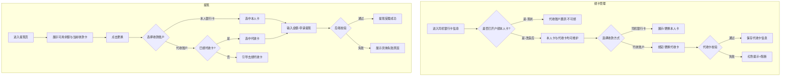
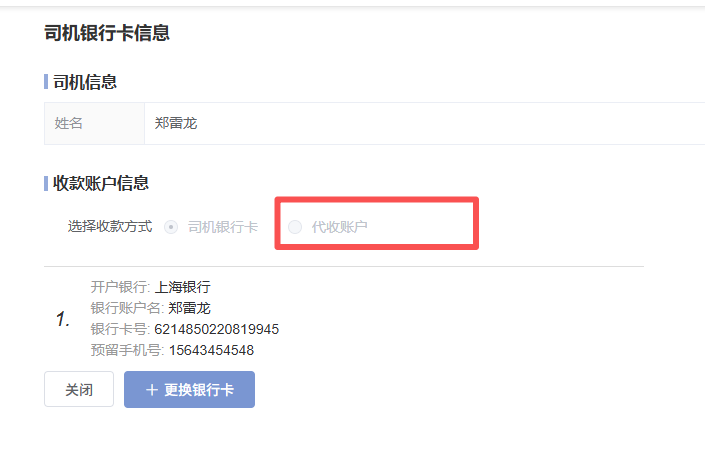
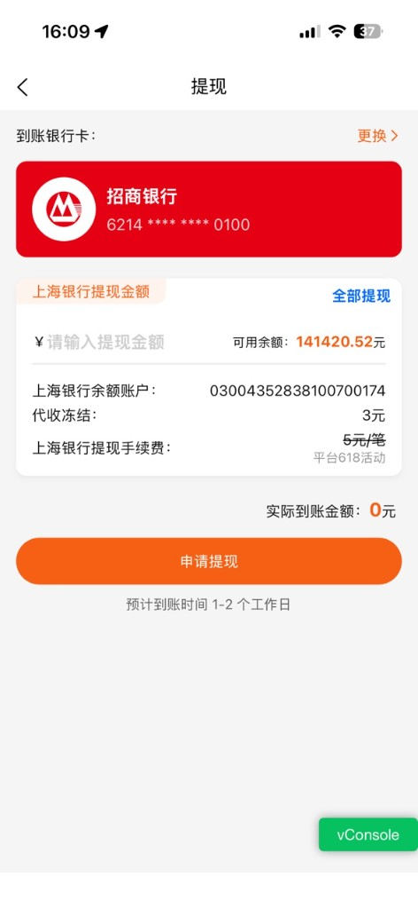

| 文档版本 | 日期 | 撰写人 | 修改描述 |
| --- | --- | --- | --- |
| V1.0 | 2026年07月10日 | — | PRD 初稿 |

## 1. 背景和目标

### 1.1 背景

司机端运费提现依赖 **上海银行（上银）** / **锡商银行** 二类户余额账户。部分司机因个人原因（如本人银行卡受限、需由亲属/车队代收运费等），希望将运费提现至 **代收账户**（非本人实名银行卡）。

**现状问题：**

1. **绑卡互斥**：司机在完善信息或银行卡管理页完成上银/锡商开户并绑定本人银行卡后，「代收账户」选项 **置灰不可选**，无法补充绑定代收卡。
2. **提现路径单一**：提现页默认走本人绑定的上银/锡商银行卡，**无法切换** 至已绑定的代收账户收取运费。
3. **与业务诉求冲突**：运营侧存在合法代收场景，但产品规则将「已开户绑卡」与「代收绑卡」做成互斥，导致司机只能换卡、无法并行维护两套收款方式。

上述问题影响部分司机提现成功率与体验，也与 7 月零碎需求中 **R5 提现失败原因** 所涉及的「代收账号禁用」等场景缺乏正向解决路径。

### 1.2 目标

1. **放开绑卡限制**：司机已开通上银/锡商且已绑定本人银行卡时，**仍可绑定代收卡**，两套账户信息可并存。
2. **支持提现切换**：申请提现时，司机可在 **本人银行卡** 与 **代收账户** 之间切换收款方式，运费按所选账户出款。
3. **规则清晰可理解**：绑卡、切换、提现各环节文案与校验明确，避免误操作与资金风险。

**范围：** 司机端 APP / 小程序 / H5；涉及银行卡管理、提现、完善信息 Step1 开户绑卡相关页面。  
**不在范围：** 上银/锡商开户接口改造、运费计价与结算规则变更、Admin 司机列表字段改造（可后续迭代）。

### 1.3 名词释义

| 名词 | 说明 |
| --- | --- |
| 上银账户 | 上海银行二类户余额账户，用于存放司机运费余额 |
| 锡商账户 | 锡商银行二类户余额账户（与上银二选一或并行，以现网规则为准） |
| 司机银行卡 | 司机本人实名绑定的银行卡，与二类户关联，用于提现到账 |
| 代收账户 / 代收卡 | 经平台审核或规则允许的 **非本人** 或 **指定代收** 银行卡，用于运费代收提现 |
| 收款方式 | 提现时选择的到账账户类型：司机银行卡 / 代收账户 |

---

## 2. 需求方案

### 2.1 功能流程图



### 2.2 需求列表

| 分类（产品模块） | 主要功能点 | 功能点拆分 | 优先级 |
| --- | --- | --- | --- |
| 司机钱包 | **变更：绑卡互斥逻辑** | 已开户绑本人卡后仍可绑代收卡<br/>代收账户选项取消置灰<br/>本人卡与代收卡信息分开展示 | P0 |
| 司机钱包 | **新增：收款方式切换** | 银行卡管理页切换默认收款方式<br/>提现页【更换】支持本人卡/代收卡切换 | P0 |
| 司机钱包 | **变更：提现出款路径** | 按当前选中收款方式出款至对应银行卡<br/>代收提现走代收卡账户 | P0 |
| 司机资质 | 完善信息 Step1 关联 | 开户绑本人卡不阻断后续绑代收卡<br/>文案说明两套卡关系 | P1 |
| 司机钱包 | 提现失败原因（关联 R5） | 代收未绑定/禁用等错误码与文案对齐 | P1 |

### 2.3 交互图

**绑代收卡（改造后）**

司机银行卡信息 → 选择「代收账户」→ 填写开户银行 / 账户名 / 卡号 / 预留手机号 → 校验通过 → 保存 → 与本人卡并存展示

**切换收款方式 · 银行卡管理**

司机银行卡信息 → 切换单选「司机银行卡」/「代收账户」→ 设为 **当前默认收款方式** → 提现页默认带出该卡

**切换收款方式 · 提现页**

提现页 → 到账银行卡右侧【更换】→ 弹层/list 展示本人卡 + 代收卡（若已绑）→ 选中 → 回写提现页 → 申请提现

**提现出款**

【申请提现】→ 后端按 **当前选中收款方式** 及对应卡号出款 → 成功 / 失败（沿用 R5 错误码体系）

---

## 3. 需求明细

| 页面 | 逻辑 |
| --- | --- |
| **R1 司机银行卡信息 · 绑卡逻辑变更**<br/>现状：代收账户置灰<br/> | **1. 入口**<br/>司机端 → 我的 / 钱包 → **司机银行卡信息**（或等价入口）。<br/><br/>**2. 现状（变更前）**<br/>「选择收款方式」含 **司机银行卡**、**代收账户** 两个单选；司机已完成上银/锡商开户且绑定本人卡时，**代收账户置灰不可选**。<br/><br/>**3. 改造后规则**<br/>- **取消互斥**：无论是否已开通上银/锡商、是否已绑本人卡，**代收账户均可选择**。<br/>- **并存展示**：本人卡与代收卡 **分别维护**，互不影响；切换单选仅表示 **当前默认收款方式**，不删除另一套卡信息。<br/>- **司机银行卡**：展示本人实名卡信息（开户银行、账户名、卡号脱敏、预留手机号）；支持【+ 更换银行卡】。<br/>- **代收账户**：未绑定时展示空态 +【绑定代收卡】；已绑定时展示代收卡信息 +【更换代收卡】。<br/><br/>**4. 代收卡字段**<br/>开户银行、银行账户名、银行卡号、预留手机号（与现网代收绑卡字段保持一致，待研发确认是否需代收协议勾选）。<br/><br/>**5. 校验**<br/>- 卡号格式、手机号格式校验；<br/>- 代收卡是否允许与本人卡同卡号：**建议禁止**（待确认）；<br/>- 代收账户禁用态（`COLLECT_ACCOUNT_DISABLED`）：入口可见但不可选，提示「代收账号已禁用，请联系客服」。<br/><br/>**6. 按钮**<br/>【关闭】关闭弹窗/返回上一页；【+ 更换银行卡】/【绑定代收卡】/【更换代收卡】进入对应绑卡流程。 |
| **R2 申请提现 · 收款账户切换**<br/>现状：仅展示一张到账卡<br/> | **1. 入口**<br/>司机端 → 钱包 → **提现**。<br/><br/>**2. 页面结构（沿用现状，增强切换）**<br/>- 到账银行卡：展示 **当前选中** 银行卡（银行 Logo + 脱敏卡号）；<br/>- 右侧【更换】：点击后弹出 **收款账户选择**（底部弹层或新页，与现网交互风格一致）。<br/><br/>**3. 收款账户选择列表**<br/>| 选项 | 展示条件 | 说明 |<br/>| --- | --- | --- |<br/>| 本人银行卡 | 已绑本人卡 | 默认选中项（若默认收款方式为本人卡） |<br/>| 代收账户 | 已绑代收卡 | 展示代收卡银行 + 脱敏卡号 |<br/>| 去绑定代收卡 | 未绑代收卡 | 跳转 R1 代收绑卡流程 |<br/><br/>**4. 切换规则**<br/>- 选中后回写提现页「到账银行卡」区域；<br/>- **本次提现** 按选中账户出款；<br/>- 若司机在银行卡管理页已设默认收款方式，进入提现页 **默认带出** 该卡，仍可临时切换。<br/><br/>**5. 余额与手续费**<br/>沿用现状：上海银行余额账户、可用余额、代收冻结、提现手续费（如 5 元/笔）展示逻辑 **不变**；变更仅为 **到账卡** 可为代收卡。<br/><br/>**6. 申请提现校验**<br/>- 未绑代收卡却选择代收：**阻断**，提示「请先绑定代收账户」并引导绑卡；<br/>- 代收禁用：提示「代收账号已禁用，无法提现，请联系客服」（对齐 R5）；<br/>- 上银/锡商冻结、余额不足等：沿用 R5 错误码与文案。 |
| **R3 完善信息 Step1 · 关联说明** | **1. 变更点**<br/>Step1 完成实名 + 上银/锡商开户 + 绑本人卡后，**不再** 在后续流程中隐藏或永久禁用代收绑卡能力。<br/><br/>**2. 文案建议（Step1 底部说明，可选 P1）**<br/>「完成本人银行卡绑定后，您仍可在钱包中绑定代收账户，用于运费提现至指定银行卡。」<br/><br/>**3. 不做**<br/>Step1 不要求同时绑代收卡；代收绑卡 **非开户前置条件**。 |
| **R4 数据与状态（后端）** | **1. 司机维度需维护字段（建议）**<br/>| 字段 | 说明 |<br/>| --- | --- |<br/>| `default_receive_type` | 默认收款方式：`SELF` / `COLLECT` |<br/>| `self_bank_*` | 本人卡信息（现网已有） |<br/>| `collect_bank_*` | 代收卡信息 |<br/>| `collect_account_status` | 正常 / 禁用 |<br/><br/>**2. 提现单记录**<br/>提现流水需记录 **收款方式类型** + **到账卡号（脱敏存储）**，便于财务对账与客诉追溯。<br/><br/>**3. 互斥逻辑下线**<br/>删除或关闭「已绑本人卡则禁止绑代收」的后端/前端开关。 |

---

## 4. 数据统计

### 4.1 核心指标

| 指标名称 | 定义 | 计算口径 | 统计周期 | 备注 |
| --- | --- | --- | --- | --- |
| 代收卡绑定率 | 司机绑定代收卡占比 | 已绑代收卡司机数 / 已开户司机数 | 周 | R1 |
| 代收提现占比 | 走代收账户的提现笔数占比 | 收款方式=代收的提现笔数 / 总提现笔数 | 周 | R2 |
| 收款方式切换次数 | 提现页点击【更换】并成功切换次数 | 切换成功事件计数 | 周 | R2 |
| 代收绑卡失败率 | 代收绑卡提交失败占比 | 绑卡失败次数 / 绑卡提交次数 | 周 | R1 |
| 代收提现失败率 | 选择代收后提现失败占比 | 代收提现失败笔数 / 代收提现申请笔数 | 周 | 关联 R5 |

### 4.2 埋点（建议）

| 事件名 | 触发时机 | 参数 |
| --- | --- | --- |
| `driver_bank_page_view` | 进入司机银行卡信息 | `has_self_card`, `has_collect_card` |
| `driver_collect_bind_click` | 点击绑定/更换代收卡 | `source`（bank_page / withdraw） |
| `driver_collect_bind_result` | 代收绑卡结果 | `success`, `fail_reason` |
| `driver_withdraw_change_card` | 提现页点击【更换】 | — |
| `driver_withdraw_card_select` | 选择收款账户 | `receive_type`（self/collect） |
| `driver_withdraw_apply` | 申请提现 | `receive_type`, `amount`, `result` |

### 4.3 列表/导出字段（提现流水）

| 字段名 | 说明 |
| --- | --- |
| 收款方式 | 司机银行卡 / 代收账户 |
| 到账银行 | 开户银行名称 |
| 到账卡号 | 脱敏银行卡号 |
| 账户名 | 银行账户名 |
| 提现金额 | 申请金额 |
| 实际到账金额 | 扣手续费后金额 |
| 二类户类型 | 上银 / 锡商 |
| 提现状态 | 受理中 / 成功 / 失败 |
| 失败原因 | 对齐 R5 错误码文案 |

---

## 5. 附录

### 5.1 与 7 月零碎需求关系

```
本需求（绑代收 + 切换收款）
  ├── 补充 R5（提现失败原因）正向能力：代收未绑、代收禁用等
  └── 与 R7（完善信息 Step1 开户绑卡）解耦：开户不阻断代收绑卡
```

### 5.2 待确认项

| 编号 | 待确认内容 | 建议 |
| --- | --- | --- |
| T1 | 代收卡是否需人工审核 | 建议首次绑代收走审核或四要素校验 |
| T2 | 代收卡账户名是否必须与司机同名 | 建议允许异名，需合规确认 |
| T3 | 本人卡与代收卡可否为同一卡号 | 建议禁止 |
| T4 | 默认收款方式切换是否同步到提现页 | 建议同步 |
| T5 | 仅开通锡商、未开通上银的司机是否同样放开 | 建议双渠道规则一致 |
| T6 | 代收提现手续费是否与本人卡一致 | 建议一致，沿用 5 元/笔等活动规则 |

### 5.3 风险控制

1. **资金安全**：代收卡绑定需强化实名校验与风控规则，防止盗绑。
2. **客诉追溯**：提现流水必须记录收款方式，便于区分本人/代收出款。
3. **禁用态**：代收账户被运营禁用后，绑卡入口可见但不可用于提现，文案与 R5 一致。

### 5.4 验收要点

- [ ] 已绑本人上银/锡商卡的司机，可成功绑定代收卡
- [ ] 银行卡管理页可在「司机银行卡」「代收账户」间切换默认收款方式
- [ ] 提现页【更换】可切换本人卡 / 代收卡，申请提现后资金至所选卡
- [ ] 未绑代收卡时选择代收，有明确引导且阻断提现
- [ ] 代收禁用、账户冻结等失败场景文案符合 R5
